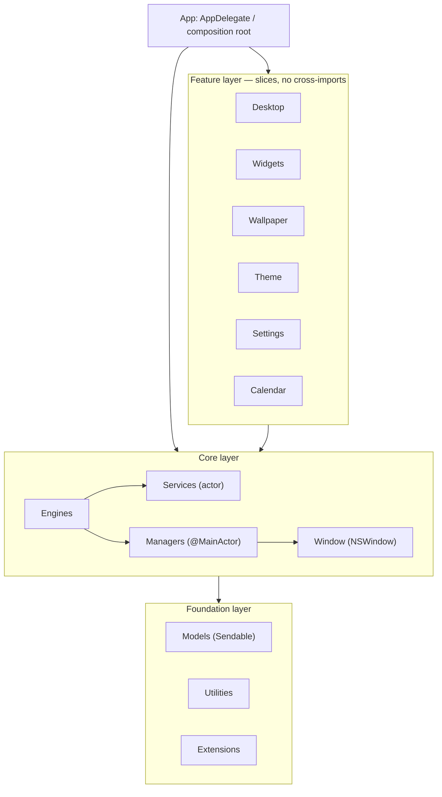

# System architecture

Desktop Frame is a native macOS desktop-customization platform: a transparent desktop-layer window system that renders live wallpaper, interactive widgets, and system information behind and above the user's app windows. This document is the top of the architecture tree. It states the system's shape, its layers and their boundaries, the rules that hold the shape together, and where each subsystem is detailed. It is a map, not a textbook: each subsystem has its own document, linked here, and each significant decision has an [ADR](../Decisions/README.md).

This document supersedes the root `Documentation/Architecture.md`, which now forwards here.

## Purpose and scope

In scope: the layered structure, module boundaries and dependency rules, the cross-cutting concurrency model, the communication paths between subsystems, and how the system is meant to scale and extend over a multi-year horizon. Out of scope: the internals of any single subsystem (those live in the linked subsystem documents), the build/process rules (those live in [Standards](../Standards) and [Processes](../Processes)), and product strategy (that lives in Notion per the [constitution](../../CLAUDE.md)).

## Context

The system runs as a single sandboxed macOS app, Apple Silicon first, on a macOS 15 baseline under Swift 6 strict concurrency ([ADR-0011](../Decisions/ADR-0011-swift6-strict-concurrency-baseline.md)). It is built to grow from a *surface* (wallpaper and widgets) into a *system* (a coherent desktop environment) into a *platform* (a third-party plugin SDK and marketplace), which is the constraint that shapes every boundary decision below: the boundaries that will one day be a public API are drawn now, even where v1 does not strictly need them.

## Design

### Layers

The system is four layers. Dependencies flow strictly downward; a layer never imports a layer above it, and — the load-bearing rule — **features never import other features** ([ADR-0004](../Decisions/ADR-0004-layered-architecture-dependency-rule.md)).

```
┌──────────────────────────────────────────────────────────────┐
│  App layer            DesktopFrameApp · AppDelegate           │
│                       composition root, lifecycle, settings   │
├──────────────────────────────────────────────────────────────┤
│  Feature layer        Desktop · Widgets · Wallpaper · Theme   │
│                       Settings · Calendar · …  (vertical)     │
├──────────────────────────────────────────────────────────────┤
│  Core layer           Engines · Managers (@MainActor)         │
│                       Services (actor) · Window (NSWindow)     │
├──────────────────────────────────────────────────────────────┤
│  Foundation layer     Models (Sendable) · Utilities · Ext.    │
└──────────────────────────────────────────────────────────────┘
        dependencies flow downward only; never sideways
```

Layered dependency model. App composes; Features are vertical slices; Core holds the engines, coordinators, actor services, and windows; Foundation is dependency-free value types and helpers.

The same structure, expressed as a module graph:



Module dependency graph. Every edge points down a layer; there is no edge between two Feature nodes.

### Responsibilities by layer

- **App** — owns process lifecycle and the object graph. `AppDelegate` (`@MainActor`, accessory activation policy) bootstraps engines, composes dependencies ([ADR-0005](../Decisions/ADR-0005-initializer-dependency-injection.md)), and owns the desktop/overlay windows. The SwiftUI `App` struct stays thin: a `Settings` scene and the delegate adaptor ([ADR-0001](../Decisions/ADR-0001-appkit-window-swiftui-content.md)).
- **Features** — vertical slices (view + view model + feature-local types) for one user-facing capability. A feature depends only on Core and Foundation. Shared behaviour between features moves *down* into Core, never sideways.
- **Core** — the engines that coordinate the system ([DesktopEngine](DesktopEngine.md), [WidgetEngine](WidgetEngine.md)), the `@MainActor` managers that hold UI-facing state and own AppKit objects ([WindowSystem](WindowSystem.md), [MultiMonitorArchitecture](MultiMonitorArchitecture.md)), the `actor` services that read system data off-main ([SystemServices](SystemServices.md), [ADR-0002](../Decisions/ADR-0002-actor-isolated-system-services.md)), and the `NSWindow` subclasses.
- **Foundation** — `Sendable` value-type models, utilities (`AppConstants`, `AppConfiguration`, `AppLogger`), and type extensions. Depends on nothing internal.

### Concurrency model

The system has two isolation domains, by design ([ADR-0002](../Decisions/ADR-0002-actor-isolated-system-services.md), [ADR-0011](../Decisions/ADR-0011-swift6-strict-concurrency-baseline.md)):

```
@MainActor domain                     actor domain (off-main)
─────────────────                     ───────────────────────
AppDelegate                           CPUService
WindowManager / MonitorManager        MemoryService / GPUService
WidgetManager                         BatteryService / StorageService
DesktopEngine / WidgetEngine          NetworkService
SwiftUI render tree                   CalendarService / ReminderService

        ▲  Sendable snapshots via AsyncStream  │
        └──────────────────────────────────────┘
                data flows upward only
```

Two isolation domains. UI, windows, and coordination are `@MainActor`; system-data acquisition is actor-isolated and off-main. Only `Sendable` snapshots cross the boundary, upward.

## Invariants

Properties that must always hold; breaking one is a bug even when the build is green. Each is owned by a subsystem document or ADR, listed here so the whole set is visible in one place.

1. **The feature graph is acyclic** — no feature imports another feature ([ADR-0004](../Decisions/ADR-0004-layered-architecture-dependency-rule.md)).
2. **The desktop surface renders below `desktopIconWindow`** so Finder icons stay interactive ([ADR-0001](../Decisions/ADR-0001-appkit-window-swiftui-content.md); `AppConstants.Window.desktopLevel`).
3. **No service performs UI work or blocks the main thread** ([ADR-0002](../Decisions/ADR-0002-actor-isolated-system-services.md)).
4. **Only `Sendable` values cross the actor↔`@MainActor` boundary** ([ADR-0011](../Decisions/ADR-0011-swift6-strict-concurrency-baseline.md)).
5. **Caches are never the source of truth** ([ADR-0008](../Decisions/ADR-0008-persistence-strategy.md)).
6. **A plugin cannot exceed the host's privileges or crash the host** ([ADR-0007](../Decisions/ADR-0007-out-of-process-plugin-isolation.md)).
7. **The performance budget is a release gate**, not an aspiration ([PerformanceStandards](../Standards/PerformanceStandards.md)).

## Data flow

System data originates in actor services, is snapshotted as `Sendable` values, and is published via `AsyncStream` to `@MainActor` managers, which hold it as `@Observable` state that the SwiftUI tree observes with property-level granularity ([ADR-0003](../Decisions/ADR-0003-observable-state-model.md)). User actions flow the other way: a view mutates injected state, an engine coordinates the effect, a manager updates a window or persists a layout. The full treatment, including event routing, caching, and persistence, is in [DataFlow](DataFlow.md).

## Communication paths

- **Vertical, synchronous-feeling:** initializer-injected protocol calls between layers (`engine.start()`, `manager.window(for:)`). The default; explicit and testable.
- **Vertical, streaming:** `AsyncStream` of `Sendable` snapshots from services up to managers.
- **Broadcast, decoupled:** a small set of reverse-DNS notifications (`AppConstants.Notifications`: `widgetDidUpdate`, `monitorConfigurationChanged`, `themeDidChange`, …) for fan-out events where the publisher must not know its observers. Used sparingly; not a substitute for an injected dependency.
- **Cross-process:** XPC to sandboxed plugin services ([ADR-0007](../Decisions/ADR-0007-out-of-process-plugin-isolation.md)).

## Scalability and extensibility strategy

The system scales along three axes, and the architecture is shaped for each:

- **More widgets/features** — vertical slicing plus the no-cross-import rule keeps feature count from turning into a dependency mesh; the cost of adding the Nth feature stays roughly constant.
- **Third-party code** — the out-of-process plugin boundary ([ADR-0007](../Decisions/ADR-0007-out-of-process-plugin-isolation.md)) and the versioned widget config schema ([ADR-0010](../Decisions/ADR-0010-widget-configuration-schema-versioning.md)) are the seams along which the platform opens up; they exist from v1 even though v1 ships first-party widgets.
- **More displays and Spaces** — per-display layouts keyed by stable identity ([ADR-0009](../Decisions/ADR-0009-per-display-independent-layouts.md)) keep multi-monitor behaviour correct as configurations multiply.

The intended hardening step is package extraction: `Foundation` and the plugin API graduate from folders to Swift packages when the public boundary is real, turning the dependency rule into a compiler guarantee ([ADR-0004](../Decisions/ADR-0004-layered-architecture-dependency-rule.md)).

## Alternatives and decisions

The system-level choices are recorded as ADRs: layering and the dependency rule ([0004](../Decisions/ADR-0004-layered-architecture-dependency-rule.md)), AppKit-window/SwiftUI-content ([0001](../Decisions/ADR-0001-appkit-window-swiftui-content.md)), actor services ([0002](../Decisions/ADR-0002-actor-isolated-system-services.md)), `@Observable` state ([0003](../Decisions/ADR-0003-observable-state-model.md)), initializer DI ([0005](../Decisions/ADR-0005-initializer-dependency-injection.md)), tiered rendering ([0006](../Decisions/ADR-0006-tiered-rendering-strategy.md)), plugin isolation ([0007](../Decisions/ADR-0007-out-of-process-plugin-isolation.md)), persistence ([0008](../Decisions/ADR-0008-persistence-strategy.md)), per-display layout ([0009](../Decisions/ADR-0009-per-display-independent-layouts.md)), config schema ([0010](../Decisions/ADR-0010-widget-configuration-schema-versioning.md)), and the Swift 6 baseline ([0011](../Decisions/ADR-0011-swift6-strict-concurrency-baseline.md)).

## Known limitations

- The dependency rule is enforced by review and folder discipline until the package split; nothing yet *prevents* a sideways import at compile time ([ADR-0004](../Decisions/ADR-0004-layered-architecture-dependency-rule.md)).
- The planned Core subfolders (`Engine`, `Managers`, `Services`, `Window`, `Features`, `Models`, `Plugins`) are architectural, not yet created; they materialise as the surface is built.
- Cross-process plugin rendering at high frame rates needs a shared-surface (`IOSurface`) design not yet specified ([PluginSDK](PluginSDK.md)).

## Future evolution

Surface → system → platform. The near-term surface milestones build the desktop window, the widget engine, and the system services; the system milestones add multi-monitor, theming, and the wallpaper engine; the platform milestones open the plugin SDK and marketplace. The architecture's job is that none of those later milestones requires re-drawing the layer boundaries — only filling them in.

## Open questions

- Does first-party-widget velocity in early milestones justify a temporary in-process widget path, given the public boundary is out-of-process ([ADR-0007](../Decisions/ADR-0007-out-of-process-plugin-isolation.md))? Tracked for the WidgetEngine milestone.
- When exactly does the `Core`/plugin-API package extraction land — at the first SDK preview, or earlier to lock the boundary? Tracked against [ADR-0004](../Decisions/ADR-0004-layered-architecture-dependency-rule.md).

## References

1. [CLAUDE.md](../../CLAUDE.md) — the constitution.
2. [FolderStructure](../Standards/FolderStructure.md) — the canonical layout and module rules.
3. Robert C. Martin, "Clean Architecture." 2017.

## Completion checklist
- [x] Purpose, boundaries, and context stated.
- [x] Design and concurrency model described with diagrams.
- [x] Invariants named explicitly.
- [x] Governing ADRs linked.
- [x] Known limitations recorded.

## Review checklist
- [ ] Matches the implemented code as subsystems are built.
- [ ] No decision present here that lacks an ADR.
- [ ] Meets DocumentationStandards.
