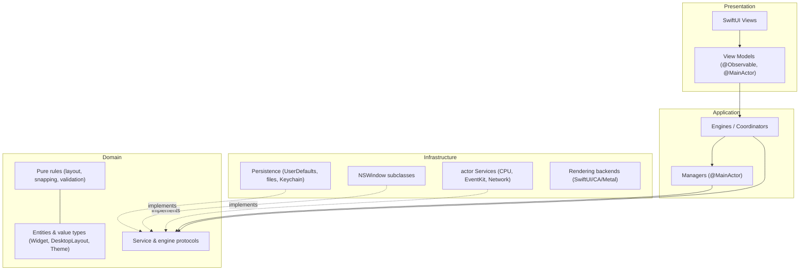

# Clean architecture and layer mapping

This document maps Desktop Frame's four physical layers onto the conceptual layers of clean architecture, so contributors recognise which clean-architecture role a given type plays and where a new type belongs. The dependency rule is governed by [ADR-0004](../Decisions/ADR-0004-layered-architecture-dependency-rule.md); this document explains the *roles*, not re-states the rule.

## Purpose and scope

In scope: the conceptual layers (presentation, application, domain, infrastructure, shared), how each maps to the repository's `App`/`Features`/`Core`/`Foundation` folders, and the direction of dependency between them. Out of scope: the folder layout itself ([FolderStructure](../Standards/FolderStructure.md)) and the concrete injection mechanism ([DependencyInjection](DependencyInjection.md)).

## Context

Clean architecture's central idea is that dependencies point inward toward stable policy (the domain), and that volatile detail (UI frameworks, the OS, the GPU) sits at the edges where it can change without disturbing the core. Desktop Frame is unusually edge-heavy — it is *made of* AppKit windows, Metal surfaces, and OS metrics — so the discipline is not "hide the platform" but "keep the platform at the edges and let a small, stable core decide policy."

## Design

### The conceptual layers

Conceptual layers and the inward dependency. Presentation and Application depend on Domain *abstractions*; Infrastructure *implements* those abstractions. The arrows of dependency point toward the domain; the arrows of data (runtime) point outward.

### Layer roles

- **Presentation** — SwiftUI views and their `@MainActor @Observable` view models. Renders state and turns user input into application calls. Knows nothing about IOKit, EventKit, or window levels. Maps to `Features/*` (views) and view models.
- **Application** — engines and managers that orchestrate use cases: "start the desktop," "add a widget," "react to a display change." They depend on domain protocols and coordinate infrastructure, but contain no platform detail themselves. Maps to `Core/Engine` and `Core/Managers`.
- **Domain** — the stable core: entity value types (`Widget`, `DesktopLayout`, `Theme`, `MonitorProfile`), the protocols every engine and service is expressed in, and pure rules (grid snapping, layout validation, config-schema checks) that are just functions over values. No framework imports beyond Foundation. Maps to `Models/` and the protocol declarations in `Core`.
- **Infrastructure** — the edges: `actor` services that call the OS, `NSWindow` subclasses, persistence backends, and rendering backends. Each *implements* a domain protocol so it can be substituted. Maps to `Core/Services`, `Core/Window`, and rendering/persistence code.
- **Shared** — cross-cutting, dependency-free helpers usable from any layer without creating coupling: `AppConstants`, `AppLogger`, `AppConfiguration`, and type extensions. Maps to `Core/Utilities` and `Core/Extensions`. Shared code never reaches *up* into application or presentation.

### Mapping table

| Conceptual layer | Repository home | Isolation | Example types |
|---|---|---|---|
| Presentation | `Features/*` views + view models | `@MainActor` | `WidgetView`, `DesktopViewModel` |
| Application | `Core/Engine`, `Core/Managers` | `@MainActor` | `DesktopEngine`, `WindowManager` |
| Domain | `Models/`, protocol decls | `Sendable` values | `Widget`, `DesktopEngineProtocol` |
| Infrastructure | `Core/Services`, `Core/Window` | `actor` / `@MainActor` | `CPUService`, `DesktopWindow` |
| Shared | `Core/Utilities`, `Core/Extensions` | mixed, stateless | `AppConstants`, `AppLogger` |

## Invariants

1. **The domain imports no UI or platform framework** beyond Foundation. A `Widget` value type that imports AppKit is a bug.
2. **Infrastructure is reached only through a domain protocol**, never by a concrete type named in presentation or application code ([DependencyInjection](DependencyInjection.md)).
3. **Shared code does not depend upward.** A utility that imports a feature is a layering violation.

## Data flow

At runtime, control flows outward (presentation → application → infrastructure) and data flows back inward as `Sendable` values. The compile-time dependency, by contrast, always points toward the domain, because every outward call goes through a domain protocol. This inversion is what lets an `actor` service be swapped for a mock in a test without the application layer noticing. The concrete runtime path is in [DataFlow](DataFlow.md).

## Alternatives and decisions

The decision to layer this way, and to enforce the dependency direction, is [ADR-0004](../Decisions/ADR-0004-layered-architecture-dependency-rule.md). The decision to express infrastructure behind protocols and inject it is [ADR-0005](../Decisions/ADR-0005-initializer-dependency-injection.md).

## Known limitations

- The domain is deliberately thin for a desktop app; much of the "logic" is orchestration in the application layer rather than rich domain rules. That is appropriate here — over-abstracting a widget into a domain aggregate would be ceremony without payoff.
- Until the package split, nothing mechanically prevents a domain type from importing AppKit; review is the guard.

## Future evolution

As the plugin SDK forms, the domain protocols that plugins implement become the public API surface, and the strongest case for extracting the domain and the plugin protocol into their own Swift package — making "the domain imports no platform framework" a compiler fact.

## References

1. Robert C. Martin, "Clean Architecture." 2017.
2. [Architecture](Architecture.md) · [ADR-0004](../Decisions/ADR-0004-layered-architecture-dependency-rule.md) · [ADR-0005](../Decisions/ADR-0005-initializer-dependency-injection.md).

## Completion checklist
- [x] Conceptual layers mapped to repository folders.
- [x] Dependency direction stated and diagrammed.
- [x] Invariants named.
- [x] Governing ADRs linked.

## Review checklist
- [ ] Matches the implemented folder structure as Core subfolders are created.
- [ ] No decision here lacking an ADR.
- [ ] Meets DocumentationStandards.
