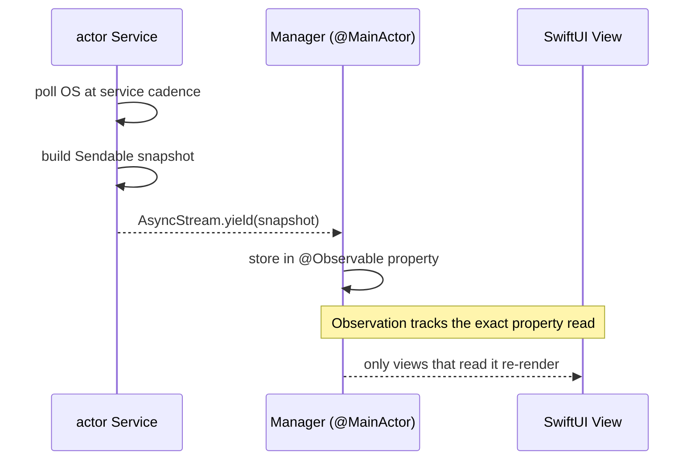
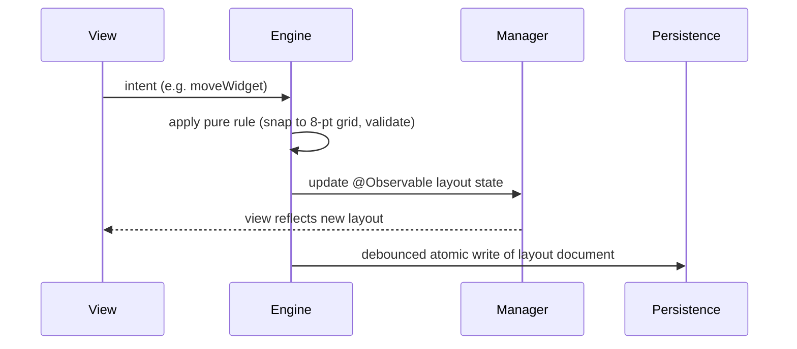

# Data flow and state management

How state originates, moves, is observed, and is persisted in Desktop Frame. This is the runtime counterpart to [Architecture](Architecture.md): the structural document says where types live, this one says how data moves between them.

## Purpose and scope

In scope: application state ownership, reactive update propagation, the service→manager→view path, caching, persistence, settings, configuration, the event-routing model, and the widget/render update loops at the data level. Out of scope: rendering mechanics ([RenderingEngine](RenderingEngine.md)) and input/hit-testing ([DesktopEngine](DesktopEngine.md)).

## Context

The surface is always on screen, so two properties dominate the design: updates must be *cheap* (no broad invalidation, no main-thread stalls) and state must be *coherent* across many widgets and several displays. The concurrency split ([ADR-0002](../Decisions/ADR-0002-actor-isolated-system-services.md)) and property-level observation ([ADR-0003](../Decisions/ADR-0003-observable-state-model.md)) are the two levers that deliver both.

## Design

### State ownership

State has exactly one owner. There is no shared global mutable state except the sanctioned `AppConfiguration.shared` (user settings).

| State | Owner | Kind | Persistence |
|---|---|---|---|
| User preferences | `AppConfiguration` (`@MainActor @Observable`) | scalars | `UserDefaults` suite |
| Widget layout (per display) | `WidgetManager` | `@Observable` over `Sendable` model | layout JSON ([ADR-0008](../Decisions/ADR-0008-persistence-strategy.md)) |
| Active theme | `ThemeManager` | `@Observable` | layout JSON |
| Monitor map | `MonitorManager` | `@Observable` | monitor-map JSON ([ADR-0009](../Decisions/ADR-0009-per-display-independent-layouts.md)) |
| Live system metrics | each `actor` service | actor-isolated snapshot | not persisted (caches only) |

### The reactive path (system data → screen)

System-data update path. A service polls off-main, emits a `Sendable` snapshot, a manager stores it, and only the views that read that property invalidate.

The cadence is per service (`AppConstants.RefreshInterval`: CPU 1 s, memory 2 s, battery 10 s, storage 30 s, calendar 60 s), so a fast metric never forces a slow one to re-poll, and an off-screen or paused widget can have its stream suspended entirely.

### The command path (user action → effect → persistence)

User-command path. Intent enters an engine, a pure rule transforms it, state updates (the UI reflects it immediately), and persistence is a debounced atomic write so dragging a widget does not write to disk on every frame.

### Event routing

Most communication is a direct injected call. For genuine fan-out — where a publisher must not know its observers — the system uses a small, fixed set of reverse-DNS notifications under `AppConstants.Notifications` (`widgetDidUpdate`, `widgetDidAdd`/`Remove`, `monitorConfigurationChanged`, `themeDidChange`, `layoutDidChange`, `wallpaperDidChange`, `permissionsDidChange`). Notifications are for broadcast facts, not for passing state a dependency could carry; new code prefers injection and adds a notification only when fan-out is real.

### Caching

Caches are derived, disposable, and never authoritative ([ADR-0008](../Decisions/ADR-0008-persistence-strategy.md)): rendered widget thumbnails, decoded wallpaper frames, and the most recent system-metric snapshot (so a newly appearing widget shows data before its first poll completes). A cache miss triggers a rebuild from the source of truth; losing the entire cache directory degrades to a brief repopulation, never to lost layout.

### Persistence and settings

Three persistence classes, by [ADR-0008](../Decisions/ADR-0008-persistence-strategy.md): scalar preferences in the `UserDefaults` suite via `AppConfiguration`; layout documents as versioned `Codable` JSON written atomically under Application Support; secrets in Keychain. Every layout document carries `schemaVersion`; the load path migrates forward when it meets an older version, and the migration is tested.

## Invariants

1. **Each piece of state has exactly one owner.** A second writer is a bug.
2. **System data only ever flows up** from services to managers to views; a view never reaches into a service ([ADR-0002](../Decisions/ADR-0002-actor-isolated-system-services.md)).
3. **Persistence writes are debounced and atomic;** an interrupted write never corrupts a layout document.
4. **Observation granularity is preserved** — a manager exposes fine-grained `@Observable` properties so a metric update invalidates only its readers ([ADR-0003](../Decisions/ADR-0003-observable-state-model.md)).

## Known limitations

- The notification channel is untyped (`Notification.userInfo`); it is kept deliberately small for that reason, and typed payloads cross via injected calls instead.
- Coalescing many simultaneous widget updates into one render pass is a [WidgetEngine](WidgetEngine.md) responsibility; this document describes the data, not the frame scheduling.

## Future evolution

When plugins run out of process ([ADR-0007](../Decisions/ADR-0007-out-of-process-plugin-isolation.md)), the service→manager path extends across an XPC boundary; the `Sendable`-snapshot discipline already makes that boundary tractable, since snapshots are exactly what serialises cleanly.

## Open questions

- Should suspended (off-screen/occluded) widget streams be fully cancelled or merely throttled? Decided per-metric during the WidgetEngine milestone, against the [performance budget](../Standards/PerformanceStandards.md).

## References

1. [ADR-0002](../Decisions/ADR-0002-actor-isolated-system-services.md) · [ADR-0003](../Decisions/ADR-0003-observable-state-model.md) · [ADR-0008](../Decisions/ADR-0008-persistence-strategy.md).
2. Apple, "AsyncStream." https://developer.apple.com/documentation/swift/asyncstream

## Completion checklist
- [x] State ownership enumerated.
- [x] Reactive and command paths diagrammed.
- [x] Caching and persistence classes stated.
- [x] Invariants named; ADRs linked.

## Review checklist
- [ ] Matches the managers and services as they are implemented.
- [ ] No decision here lacking an ADR.
- [ ] Meets DocumentationStandards.
