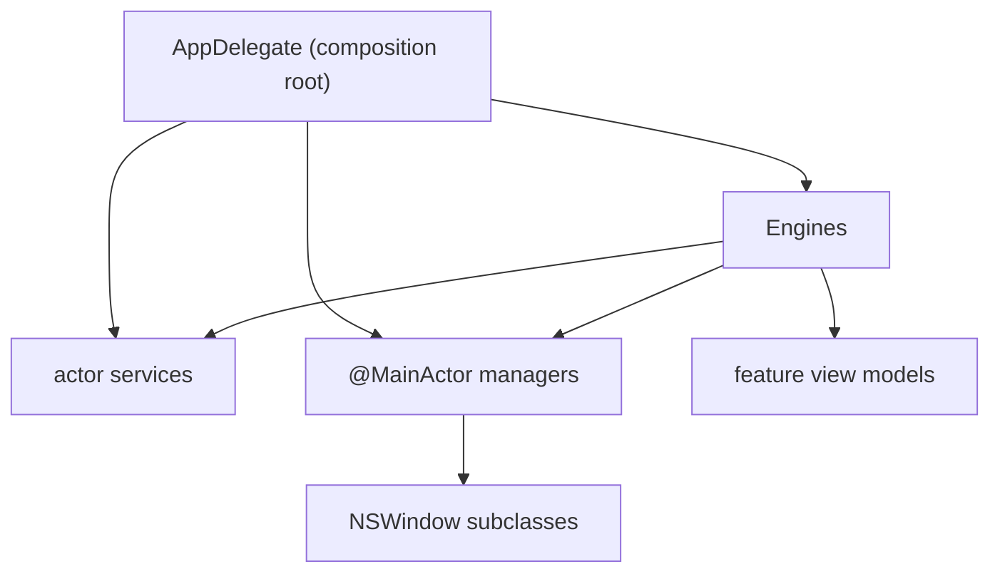

# Dependency injection

How Desktop Frame supplies collaborators to the types that need them. The decision to inject through initializers with a single composition root is [ADR-0005](../Decisions/ADR-0005-initializer-dependency-injection.md); this document is the working detail: the container shape, lifetimes, and the test and environment story.

## Purpose and scope

In scope: the injection strategy, the composition root's structure, object lifetimes, how injection enables testing, and how the SwiftUI environment fits. Out of scope: the layering rule that injection enforces ([ADR-0004](../Decisions/ADR-0004-layered-architecture-dependency-rule.md)).

## Context

The system is protocol-first: every engine and service has a protocol. That investment only pays off if concrete types are injected rather than reached through globals, so substitution (for tests, for plugins, for fakes) is possible without touching call sites.

## Design

### Strategy

Initializer injection. A type declares its collaborators as protocol-typed `init` parameters and stores them; it never constructs them and never reaches a global to find them. The one sanctioned global is `AppConfiguration.shared` (user settings), which is state, not an injectable service.

```swift
// Illustrative — shapes only.
@MainActor
final class DesktopEngine: DesktopEngineProtocol {
    private let widgetEngine: WidgetEngineProtocol
    private let windowManager: WindowManaging
    private let monitorManager: MonitorManaging

    init(widgetEngine: WidgetEngineProtocol,
         windowManager: WindowManaging,
         monitorManager: MonitorManaging) {
        self.widgetEngine = widgetEngine
        self.windowManager = windowManager
        self.monitorManager = monitorManager
    }
}
```

### The composition root

`AppDelegate` is the composition root: the one place the full object graph is assembled, on `applicationDidFinishLaunching`. It is not a container framework — it is plain Swift that constructs concrete types and passes them down. As the graph grows, the root is decomposed into per-subsystem *assembler* functions (`makeDesktopEngine(...)`, `makeServices(...)`) that are still initializer injection, just grouped for readability. A DI container/framework is explicitly not adopted ([ADR-0005](../Decisions/ADR-0005-initializer-dependency-injection.md)).



The composition root wires concrete implementations once and hands protocols downward; nothing below the root constructs its own dependencies.

### Lifetimes

| Lifetime | Meaning | Examples |
|---|---|---|
| Singleton-for-process | one instance, lives for the app | engines, managers, services, `AppConfiguration` |
| Per-display | one instance per active display | `DesktopWindow`, per-display layout state |
| Per-widget | created and destroyed with a widget | widget view model, widget render context |
| Transient | created per use, no retained state | pure-rule helpers, formatters |

Lifetimes are managed by ownership, not by a container's scope registry: the composition root owns process-singletons; the `MonitorManager` owns per-display objects; the `WidgetManager` owns per-widget objects. When an owner is released, its owned graph is released.

### Environment injection (SwiftUI)

Views receive `@Observable` models through the SwiftUI environment (`@Environment`, `@Bindable`), which is the view-appropriate form of the same idea: the model is composed by the root and *handed* to the view tree, never self-instantiated inside `body`. This keeps view models testable (a preview or test injects a fake model) and keeps `body` free of construction.

```swift
// Illustrative.
ContentView()
    .environment(desktopViewModel)   // injected from the root, not built in-place
```

## Invariants

1. **No type constructs its own injectable collaborators.** Construction happens at the root.
2. **No production type reads a service through a global.** `Service.shared` does not exist for services ([ADR-0005](../Decisions/ADR-0005-initializer-dependency-injection.md)).
3. **Every collaborator is a protocol at the injection site,** so it can be substituted in a test.

## Data flow

Injection is a startup-time concern: the root resolves the graph once. At runtime, the injected references are just stored properties used directly. There is no runtime resolution step that can fail — the absence of a dependency is a compile error, not a launch-time crash.

## Testing

Because every collaborator is a protocol-typed `init` parameter, any unit under test is constructed with mocks: a service test injects a clock; an engine test injects fake managers; a view-model test injects a fake `@Observable` model. No global state to reset between tests, no container to configure. The patterns are in [TestingStrategy](../Development/TestingStrategy.md).

## Known limitations

- The composition root grows with the system and is itself a place to review for correctness; the assembler decomposition is the mitigation, not a container.
- Manual wiring means adding a dependency edits the root; this is the intended cost of keeping the graph explicit ([ADR-0005](../Decisions/ADR-0005-initializer-dependency-injection.md)).

## Future evolution

When `Core` and the plugin API become Swift packages, the assembler functions are the natural seam to split along; the root composes package-provided assemblers rather than reaching into package internals.

## References

1. [ADR-0005](../Decisions/ADR-0005-initializer-dependency-injection.md).
2. Mark Seemann, "Dependency Injection Principles, Practices, and Patterns." 2019.

## Completion checklist
- [x] Strategy, root, lifetimes, and environment injection described.
- [x] Testing implication stated.
- [x] Invariants named; ADR linked.

## Review checklist
- [ ] Matches the composition root as it is implemented.
- [ ] No decision here lacking an ADR.
- [ ] Meets DocumentationStandards.
