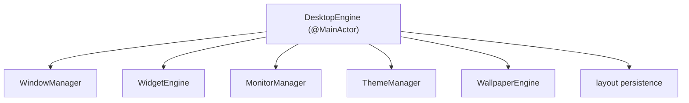

# Desktop engine architecture

The desktop engine is the coordinator of the always-on surface: it owns the desktop canvas, routes input across the AppKit/SwiftUI seam, manages the interactive/click-through duality that lets the surface be both a backdrop and a workspace, and persists the layout. It does not draw and it does not poll the system; it orchestrates the managers and engines that do.

## Purpose and scope

In scope: the desktop overlay and canvas, Finder and desktop-icon compatibility, transparency and click-through, mouse/keyboard/drag handling, layout persistence, and event routing on the surface. Out of scope: window creation/levels ([WindowSystem](WindowSystem.md)), widget internals ([WidgetEngine](WidgetEngine.md)), and pixels ([RenderingEngine](RenderingEngine.md)).

## Context

The surface has a hard duality: most of the time it is a *backdrop* that must let clicks, scrolls, and drags pass straight through to Finder and the desktop icons beneath it; some of the time it is a *workspace* where the user arranges and operates widgets. Getting this duality right — without a visible mode switch that feels clumsy, and without ever trapping input that belonged to Finder — is the engine's central problem.

## Design

### Position in the stack

The desktop engine coordinates the managers that own windows, widgets, monitors, theme, and wallpaper; it holds no system data itself.

### The canvas and interaction modes

Each `DesktopWindow` hosts a *canvas*: the SwiftUI coordinate space in which widgets are laid out, snapped to the 8-point grid (`AppConstants.Widget.snapGrid`), and persisted. The canvas runs in one of two interaction modes:

- **Backdrop mode (default):** the window `ignoresMouseEvents`, so every click/scroll/drag passes through to Finder and desktop icons. Widgets are visible but not interactive. This is the invariant state — the surface never traps input it was not given.
- **Edit/interactive mode:** the window accepts events; the user can drag, resize, configure, and operate widgets. Entered by an explicit, low-friction gesture (e.g. a modifier-held click or a menu-bar toggle) and exited automatically when interaction ends.

The transition is driven by hit-testing: where a widget declares an interactive region, the engine can selectively accept events for that region while passing the rest through, so common cases (clicking a widget button) do not require a global mode switch. *(Inference: per-region pass-through across the AppKit/SwiftUI seam is implemented with `NSView` hit-test overrides feeding the hosting view; the exact mechanism is validated in the desktop milestone.)*

### Finder and desktop-icon compatibility

The surface sits below the Finder desktop-icon window ([WindowSystem](WindowSystem.md)), so icons render on top and remain operable by construction. The engine additionally must not interfere with Finder's own drag-and-drop (dragging a file on the desktop) — backdrop mode guarantees this, since events never reach the surface in the first place. Widgets that accept file drops do so only in interactive mode and only within their own bounds.

### Input handling

- **Mouse:** routed by mode and hit-test, as above. Drag of a widget snaps to the grid and updates layout state live; the visual follows the cursor while the persisted write is debounced ([DataFlow](DataFlow.md)).
- **Keyboard:** the surface is non-key by default; keyboard input is captured only when a widget is the active responder in interactive mode, and global shortcuts (show/hide, toggle edit) are handled by a separate global monitor gated on `AppConfiguration.enableGlobalShortcuts`.
- **Drag:** widget moves, resizes, and inter-widget reordering, all grid-aligned and bounded to the canvas.

### Layout persistence and event routing

Layout (widget identities, positions, sizes, per-widget config) is owned by the `WidgetManager`, persisted as a versioned layout document per display ([ADR-0008](../Decisions/ADR-0008-persistence-strategy.md), [ADR-0009](../Decisions/ADR-0009-per-display-independent-layouts.md)). The engine routes surface events to the right widget and routes lifecycle facts (a widget added/removed, a layout changed) out as `AppConstants.Notifications` for decoupled observers, while using direct injected calls for everything that has a known recipient.

## Invariants

1. **In backdrop mode the surface traps no input;** Finder and desktop icons behave exactly as if Desktop Frame were not running.
2. **Widgets snap to the 8-point grid** and stay within canvas bounds.
3. **Layout changes are persisted debounced and atomically;** a drag does not write per frame, and an interrupted write never corrupts the layout.
4. **The engine holds no system metrics and draws nothing;** it only coordinates.

## Data flow

User input → hit-test/mode decision → either pass-through to Finder or dispatch to a widget → layout mutation in `WidgetManager` → immediate UI reflection + debounced persistence. Lifecycle events fan out as notifications.

## Alternatives and decisions

The click-through duality rests on the window-level and event-transparency model of [ADR-0001](../Decisions/ADR-0001-appkit-window-swiftui-content.md) and [WindowSystem](WindowSystem.md). Per-display layout is [ADR-0009](../Decisions/ADR-0009-per-display-independent-layouts.md).

## Known limitations

- Per-region selective pass-through across the hosting-view seam is the trickiest mechanic and is validated empirically in the desktop milestone; the fallback is an explicit edit-mode toggle with no per-region magic.
- Interaction with Finder's "Use Stacks" and label arrangement is observed behaviour to be re-checked per macOS release.

## Future evolution

The interaction-mode machinery is the seam through which richer direct-manipulation (multi-select, alignment guides, snapping to other widgets) arrives without changing the backdrop-mode guarantee.

## Open questions

- The default gesture to enter interactive mode — modifier-click, long-press, or menu-bar/global-shortcut only — is a UX decision pending [Design](../Design/DesignSystem.md) input.

## References

1. [ADR-0001](../Decisions/ADR-0001-appkit-window-swiftui-content.md) · [WindowSystem](WindowSystem.md) · [WidgetEngine](WidgetEngine.md).
2. Apple, "Handling mouse events" (NSView hit-testing). https://developer.apple.com/documentation/appkit/nsview

## Completion checklist
- [x] Canvas, interaction modes, and pass-through described.
- [x] Finder/desktop-icon compatibility addressed.
- [x] Mouse/keyboard/drag handling and persistence described.
- [x] Invariants named; ADRs linked.

## Review checklist
- [ ] Matches the desktop engine implementation.
- [ ] Pass-through behaviour verified against Finder on current macOS.
- [ ] Meets DocumentationStandards.
