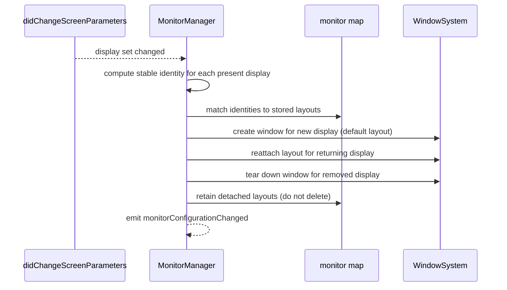

# Multi-monitor architecture

How Desktop Frame behaves across multiple, changing displays: detecting them, keeping each one's arrangement bound to the right physical screen across hot-plug and rearrangement, and reflowing on resolution and scale changes. The governing decision — independent per-display layouts keyed by stable identity — is [ADR-0009](../Decisions/ADR-0009-per-display-independent-layouts.md); this document is its mechanism.

## Purpose and scope

In scope: display detection, independent vs shared layouts, monitor profiles, resolution/scale changes, Retina/HiDPI scaling, workspace persistence, dock movement, and hot-plugging. Out of scope: window creation/levels ([WindowSystem](WindowSystem.md)) and wallpaper rendering ([WallpaperEngine](WallpaperEngine.md)).

## Context

A Mac's display set is fluid: laptops dock and undock, monitors are added and removed, resolutions change, and arrangements differ between locations. The worst failure for a desktop-arrangement product is layouts jumping to the wrong screen on a plug event, which is exactly what positional (array-index) keying produces. The design exists to make reattachment correct and non-destructive.

## Design

### Display identity

Each display is identified by a **stable identity** derived from durable hardware attributes (vendor/model and, where exposed, serial, surfaced via the display's UUID), not by `NSScreen` array index (positional, unstable) nor by `CGDirectDisplayID` alone (reassigned across reconnects). The identity keys that display's layout and wallpaper in the persisted monitor map (`AppConstants.Storage.monitorMapKey`).

### The reconcile algorithm

Reconcile on display change. Present displays are matched to stored identities; new displays get a default, returning displays get their saved layout, removed displays keep their layout in reserve.

The key property: **detached layouts are retained, not deleted**, so unplugging and replugging a monitor restores its arrangement exactly. A display seen for the first time receives a sensible default layout (a starter widget arrangement scaled to its size).

### Independent vs shared layouts

The underlying model is independent-per-display. A *shared* (mirrored) layout — the same arrangement on every display — is offered as an explicit user choice layered on top, implemented by binding multiple display identities to one layout, never by collapsing the model. This keeps "different arrangements per monitor" (the common case) as the natural default and "same everywhere" as an opt-in.

### Monitor profiles

A *monitor profile* is the bundle of a display's identity plus its layout, wallpaper, and scale preferences. Profiles make the location case work: the same laptop meeting the office 4K and the home ultrawide simply matches different stored profiles. Profiles are part of workspace persistence and travel in the monitor map.

### Resolution, scale, and Retina

A resolution or scale change on a display is treated as the *same* display (same identity), not a new one, so its layout is preserved and **reflowed** to the new geometry rather than reset. Widget positions are stored in a scale-independent coordinate space and snapped to the 8-point grid at the active backing scale, so a HiDPI ⇄ standard transition keeps relative arrangement. `AppConfiguration.enableHighDPIRendering` controls native-resolution rendering on HiDPI screens.

### Dock movement and arrangement

Moving the Dock or rearranging displays changes each display's `visibleFrame`; the surface re-homes to the new frames on `monitorConfigurationChanged` without disturbing layout identity. Widgets anchored relative to screen edges follow the edge, so a Dock that moves does not occlude an edge-anchored widget.

## Invariants

1. **Layouts are keyed by stable display identity,** never array index ([ADR-0009](../Decisions/ADR-0009-per-display-independent-layouts.md)).
2. **Detached layouts are retained;** reconnect is non-destructive.
3. **A resolution/scale change reflows, not resets,** the affected display.
4. **One `DesktopWindow` per active display,** reconciled on every change ([WindowSystem](WindowSystem.md)).

## Data flow

`didChangeScreenParametersNotification` → identity computation → match/create/reattach/teardown → retain detached layouts → emit `monitorConfigurationChanged` → window system and wallpaper engine react.

## Alternatives and decisions

Independent per-display layout keyed by stable identity, with retained detached layouts and an opt-in shared mode: [ADR-0009](../Decisions/ADR-0009-per-display-independent-layouts.md). Array-index and `CGDirectDisplayID`-only keying were rejected there.

## Known limitations

- Two identical external monitors with no exposed serial are genuinely ambiguous; the fallback keys them by port/position and accepts that swapping them may swap layouts, surfaced to the user rather than hidden ([ADR-0009](../Decisions/ADR-0009-per-display-independent-layouts.md)).
- Sidecar/AirPlay displays may expose different identity attributes than physical displays; handled as first-seen profiles and re-verified per macOS release.

## Future evolution

The profile model generalises to user-named workspaces ("Focus," "Presentation") that re-arrange widgets across all displays at once — a feature that extends the profile/identity machinery rather than replacing it.

## Open questions

- Whether to offer explicit user-named profiles in v1 or infer them from location automatically.

## References

1. [ADR-0009](../Decisions/ADR-0009-per-display-independent-layouts.md) · [WindowSystem](WindowSystem.md).
2. Apple, "NSScreen." https://developer.apple.com/documentation/appkit/nsscreen
3. Apple, "Quartz Display Services." https://developer.apple.com/documentation/coregraphics/quartz_display_services

## Completion checklist
- [x] Identity, reconcile, profiles, and shared/independent model described.
- [x] Resolution/scale/Retina and dock movement addressed.
- [x] Invariants named; ADR linked.

## Review checklist
- [ ] Matches the MonitorManager implementation.
- [ ] Hot-plug and reattach verified on real multi-display hardware.
- [ ] Meets DocumentationStandards.
