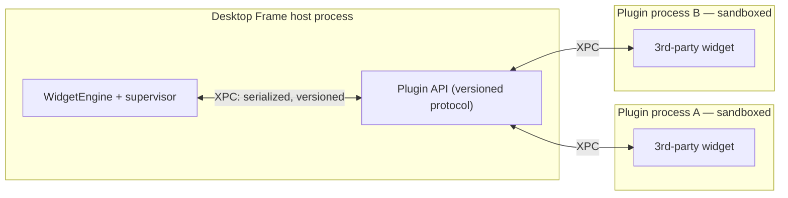

# Plugin SDK architecture

The plugin SDK is the boundary that turns Desktop Frame from a product into a platform: the stable, versioned, sandboxed contract third parties build against. This document is the architecture of that boundary — its lifecycle, API shape, isolation, versioning, permissions, and the developer and marketplace experience around it. It is forward-looking: v1 ships first-party widgets, but the boundary is designed and partly built now because a public API cannot be retrofitted cheaply once shipped.

## Purpose and scope

In scope: plugin lifecycle, API design, sandboxing, versioning, permissions, security, the marketplace, developer experience, and future compatibility. Out of scope: the host-side supervision detail ([WidgetEngine](WidgetEngine.md)) and the App Sandbox rules in general ([SecurityStandards](../Standards/SecurityStandards.md)). The authoring-facing spec uses [PluginSpecification](../Templates/PluginSpecification.md).

## Context

Third-party code on an always-on, system-integrated surface is the hardest thing this product does safely. It must be impossible for a plugin to crash the desktop, exceed the user's consent, read another plugin's data, or break when the host updates. Those four requirements are why the boundary is out-of-process, capability-gated, and versioned — decided in [ADR-0007](../Decisions/ADR-0007-out-of-process-plugin-isolation.md) and [ADR-0010](../Decisions/ADR-0010-widget-configuration-schema-versioning.md).

## Design

### The boundary

The plugin boundary. Each plugin is its own sandboxed process; all interaction crosses a versioned XPC contract, so a plugin shares neither address space nor entitlements with the host or other plugins.

### Plugin lifecycle

Discover (a signed bundle is found/installed) → validate (signature, manifest, declared capabilities and schema) → register (its widget types enter the catalog) → launch on demand (the XPC service starts when a widget of its type is first placed) → run under supervision (health, restart on crash, resource caps) → update (a new version is validated and its config migrated, [ADR-0010](../Decisions/ADR-0010-widget-configuration-schema-versioning.md)) → uninstall (process torn down, data removed). A plugin is launched lazily and suspended when none of its widgets are visible.

### API design

The API is a **serializable, versioned protocol**, not a shared object graph. A plugin provides: a manifest (identity, version, capabilities, declared widget types and their config schemas), and per widget a render description (a constrained Tier-1 SwiftUI subset or a data-plus-view-model the host renders) and update logic. The host provides: configuration, lifecycle calls, granted system-data snapshots, and user-action delivery. Rich types do not cross the boundary; everything is `Codable`/`Sendable`. This keeps the contract small, inspectable, and stable.

### Permissions and security

Permissions are **per-plugin, declared, and least-privilege** ([SecurityStandards](../Standards/SecurityStandards.md)): a plugin lists the capabilities it needs (e.g. calendar data, network, Tier-3 GPU rendering, location), and the user grants them at install or first use. A plugin gets only what it declared and the user approved, and can never exceed the host's own sandbox. Data from one plugin is invisible to another. Anything that would send data off device follows the consent-and-escalation rule ([SecurityStandards](../Standards/SecurityStandards.md)) — the SDK cannot be used to exfiltrate user data silently.

### Versioning

Three independently versioned things meet here — the host app, the plugin API, and persisted plugin data — each SemVer'd per [VersioningStrategy](../Processes/VersioningStrategy.md). The plugin API maintains backward compatibility within a major version: a plugin built against API 1.x runs on any host with API 1.y ≥ x. A breaking API change is a new major version with a documented migration. Widget config migrates via the schema hook ([ADR-0010](../Decisions/ADR-0010-widget-configuration-schema-versioning.md)).

### Marketplace

The marketplace is the distribution and trust channel: signed, notarised plugin bundles with declared capabilities, reviewed before listing. The host's discover/validate/register/permission machinery is what a marketplace install drives; rating, updates, and revocation (a pulled plugin can be disabled host-side) ride on top. The marketplace is a later milestone, but its requirements (signing, capability manifests, revocation) are designed into the boundary now.

### Developer experience

A plugin author gets: a documented protocol ([PluginSpecification](../Templates/PluginSpecification.md)), a project template, the auto-generated settings UI from the config schema (so no bespoke settings code), local sideloading for development, and a host-provided test harness that runs a plugin against a mock host. The goal is that a competent Swift developer ships a useful widget in an afternoon without learning the host's internals.

## Invariants

1. **A plugin runs out of process and cannot crash the host** ([ADR-0007](../Decisions/ADR-0007-out-of-process-plugin-isolation.md)).
2. **A plugin gets only its declared, user-granted capabilities** and never exceeds the host sandbox ([SecurityStandards](../Standards/SecurityStandards.md)).
3. **One plugin's data is invisible to another.**
4. **The API is backward-compatible within a major version** ([VersioningStrategy](../Processes/VersioningStrategy.md)).
5. **Nothing crosses the boundary that is not `Codable`/`Sendable`.**

## Data flow

Manifest + render description in (validated, versioned); configuration, granted snapshots, and lifecycle calls down; render output and user-action/capability requests up — all over XPC.

## Alternatives and decisions

Out-of-process isolation: [ADR-0007](../Decisions/ADR-0007-out-of-process-plugin-isolation.md). Versioned config schema: [ADR-0010](../Decisions/ADR-0010-widget-configuration-schema-versioning.md). In-process/scripted-sandbox alternatives were rejected in [ADR-0007](../Decisions/ADR-0007-out-of-process-plugin-isolation.md). A follow-up ADR will fix the concrete XPC message schema and the `IOSurface` shared-render path when the SDK is built.

## Known limitations

- High-frequency cross-process rendering (Tier-3 plugin widgets) needs a shared-surface (`IOSurface`) design not yet specified; until then third-party shader content is constrained.
- The signing/notarisation and revocation pipeline is a marketplace-milestone deliverable, specified here but not built.

## Future evolution

The same boundary that carries widgets carries third-party themes and wallpapers (Tier-3 shaders), so opening those is an extension of this contract, not a new one. API major versions are the long-term compatibility mechanism that lets the platform evolve without breaking the ecosystem.

## Open questions

- The exact XPC message schema and whether a higher-level RPC layer is worth it over raw `NSXPCConnection`.
- Whether v1's "platform preview" exposes sideloaded plugins before the marketplace exists.

## References

1. [ADR-0007](../Decisions/ADR-0007-out-of-process-plugin-isolation.md) · [ADR-0010](../Decisions/ADR-0010-widget-configuration-schema-versioning.md) · [VersioningStrategy](../Processes/VersioningStrategy.md) · [PluginSpecification](../Templates/PluginSpecification.md).
2. Apple, "XPC." https://developer.apple.com/documentation/xpc
3. Apple, "App Sandbox." https://developer.apple.com/documentation/security/app-sandbox

## Completion checklist
- [x] Lifecycle, API shape, isolation, versioning, permissions described.
- [x] Marketplace and developer experience addressed.
- [x] Invariants named; ADRs/standards linked; forward-looking scope flagged.

## Review checklist
- [ ] Re-reviewed when the SDK milestone begins and the XPC schema ADR is written.
- [ ] No decision here lacking an ADR.
- [ ] Meets DocumentationStandards.
