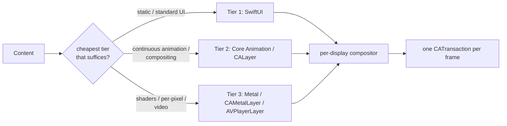

# Rendering engine architecture

The rendering engine is how Desktop Frame turns widget and wallpaper content into pixels within a strict, always-on performance budget. It is not one renderer but a tiered pipeline that places each piece of content on the cheapest technology that can express it, and a frame scheduler that coalesces all of it into one composite per display per frame.

## Purpose and scope

In scope: the SwiftUI/Core Animation/Metal tiers and the pipeline that drives them, the animation pipeline, refresh scheduling, GPU usage, the per-frame budget, and the fallback strategy. Out of scope: what content means ([WidgetEngine](WidgetEngine.md), [WallpaperEngine](WallpaperEngine.md)) and where it lands ([WindowSystem](WindowSystem.md)).

## Context

The budget ([PerformanceStandards](../Standards/PerformanceStandards.md)) is the design driver: idle CPU under 0.5%/core, widget render under 8 ms on 120 Hz displays, live wallpaper at negligible battery cost via hardware decode, one `CATransaction` per frame. An always-on surface cannot afford broad invalidation, software decode, or per-widget layout passes. The engine exists to make the cheap path the default and the expensive path deliberate.

## Design

### The three tiers

Per [ADR-0006](../Decisions/ADR-0006-tiered-rendering-strategy.md):

Tier selection and composition. Content starts at Tier 1 and escalates only on a measured need; all tiers feed one compositor that emits a single transaction per frame.

- **Tier 1 — SwiftUI.** Default. Declarative, accessible, themeable; property-level invalidation ([ADR-0003](../Decisions/ADR-0003-observable-state-model.md)) keeps redraws minimal. The `swiftui-performance` discipline governs Tier 1 cost.
- **Tier 2 — Core Animation.** `CALayer`-based rendering for continuous animation and compositing where SwiftUI body re-evaluation would be wasteful. Reached through the AppKit bridge.
- **Tier 3 — Metal.** `CAMetalLayer`/`MTKView` for shaders and per-pixel content; `AVPlayerLayer` with VideoToolbox hardware decode for video wallpaper. Never software decode in the hot path.

### Refresh scheduling

The engine drives the surface from a display-linked clock (`CADisplayLink`-equivalent / `CVDisplayLink`), one per display, matched to that display's refresh rate (including ProMotion's variable rate). Per tick it: collects dirty content, asks the [WidgetEngine](WidgetEngine.md) for the coalesced update set (bounded by `maxConcurrentWidgetUpdates`), lets each dirty piece render in its tier, and commits one composite transaction. Clean content costs nothing; a static clock between minute ticks does no work.

### Animation pipeline

Animations use the shared timing system (`AppConstants.Animation`: default/fast/slow durations, spring response/damping) so motion is consistent across widgets and the system honours `Reduce Motion` in one place ([AccessibilityStandards](../Standards/AccessibilityStandards.md)) — when reduced, animations collapse to instant or cross-fade. Tier 1 uses SwiftUI animation; Tier 2/3 use Core Animation/Metal timing driven by the same constants, so a spring feels the same whoever drew it.

### GPU usage and budget allocation

The per-frame budget is allocated, not assumed: wallpaper (especially Tier 3) is the largest GPU consumer and is capped so widgets retain headroom; widgets are expected to be near-free in Tier 1. The engine measures against the budget with the Instruments Core Animation and Metal templates ([PerformanceStandards](../Standards/PerformanceStandards.md)); a change in the pipeline attaches a [PerformanceReport](../Templates/PerformanceReport.md) with before/after numbers. Overdraw (stacked opaque layers) and software decode are the two named regressions watched for.

### Fallback strategy

The pipeline degrades rather than fails:

- **GPU/Metal unavailable or low-power mode:** Tier 3 content degrades to a static representation (last frame or a poster image); the surface stays correct, just less lively.
- **Thermal pressure / Low Power Mode:** the engine lowers wallpaper frame rate and pauses non-essential animation, honouring the system power state.
- **Budget breach detected:** the offending tier is throttled and logged (`AppLogger.rendering`) before frames are dropped.

## Invariants

1. **One `CATransaction` per display per frame;** no per-widget layout pass ([PerformanceStandards](../Standards/PerformanceStandards.md)).
2. **No software decode in the hot path;** video/live wallpaper uses hardware decode.
3. **Content renders in the lowest tier that suffices;** escalation is measured and justified ([ADR-0006](../Decisions/ADR-0006-tiered-rendering-strategy.md)).
4. **Clean content costs nothing;** the scheduler does no work for unchanged pixels.
5. **`Reduce Motion` is honoured centrally** for all tiers.

## Data flow

Display clock tick → collect dirty set → coalesced widget updates + wallpaper frame → per-tier render → single composite transaction → display. Power/thermal state feeds the scheduler to throttle.

## Alternatives and decisions

Tiering and the escalation rule: [ADR-0006](../Decisions/ADR-0006-tiered-rendering-strategy.md). All-SwiftUI and all-Metal were both rejected there. The hardware-decode requirement is [PerformanceStandards](../Standards/PerformanceStandards.md).

## Known limitations

- Cross-process (plugin) Tier-3 rendering needs a shared-surface (`IOSurface`) path; until specified, third-party shader widgets are constrained ([WidgetEngine](WidgetEngine.md), [PluginSDK](PluginSDK.md)).
- Per-display variable refresh (ProMotion) scheduling interacts with multi-display vsync in ways verified empirically per hardware.

## Future evolution

The compositor is the seam for future effects (cross-widget blur, depth, parallax) and for the `IOSurface` plugin render path. The tier model means new capabilities slot in as Tier 2/3 without disturbing Tier 1 widgets.

## Open questions

- The exact wallpaper GPU cap (as a share of frame budget) per hardware class — set empirically with Instruments in the wallpaper milestone.

## References

1. [ADR-0006](../Decisions/ADR-0006-tiered-rendering-strategy.md) · [PerformanceStandards](../Standards/PerformanceStandards.md) · [METAL_ENGINEER](../../.agents/METAL_ENGINEER.md).
2. Apple, "Core Animation." https://developer.apple.com/documentation/quartzcore
3. Apple, "Metal." https://developer.apple.com/documentation/metal
4. Apple, "VideoToolbox." https://developer.apple.com/documentation/videotoolbox

## Completion checklist
- [x] Tiers, scheduler, animation, GPU, and fallback described.
- [x] Per-frame budget and measurement stated.
- [x] Invariants named; ADRs linked.

## Review checklist
- [ ] Matches the rendering implementation.
- [ ] Budget verified with Instruments on the hardware matrix.
- [ ] Meets DocumentationStandards.
