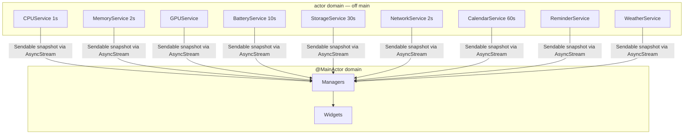

# System services architecture

The system services are the off-main `actor` providers that feed Desktop Frame its live data: CPU, memory, GPU, battery, storage, network, calendar, reminders, weather, notifications, plus the cross-cutting settings, telemetry, logging, and diagnostics. They are the infrastructure edge of the clean architecture — each one wraps a platform API behind a protocol so the rest of the system depends on data, not on IOKit.

## Purpose and scope

In scope: the service model and its concurrency, the catalogue of services, polling and sharing, permissions, and the logging/diagnostics/telemetry cross-cuts. Out of scope: how data is consumed and rendered ([DataFlow](DataFlow.md), [WidgetEngine](WidgetEngine.md)). The decision to make services actors is [ADR-0002](../Decisions/ADR-0002-actor-isolated-system-services.md).

## Context

These reads call blocking or latency-bearing APIs (`host_statistics64`, IOKit power sources, EventKit, `NWPathMonitor`) that would stall the render loop if run on the main thread. They also touch privacy-sensitive data (calendar, reminders, location for weather) that requires consent. Both forces are answered by the same model: actor isolation off-main ([ADR-0002](../Decisions/ADR-0002-actor-isolated-system-services.md)) plus point-of-use permission ([SecurityStandards](../Standards/SecurityStandards.md)).

## Design

### The service model

Each provider is a Swift `actor` behind a protocol, emitting `Sendable` snapshots on its own cadence (`AppConstants.RefreshInterval`) via `AsyncStream`, logging under `AppLogger.services`, and touching no UI. Consumers (managers, widgets) subscribe; the service owns its timer, cache, and the platform handle.

System services and their cadences publishing upward to `@MainActor` consumers. Each metric polls independently; none blocks the main thread.

### Service catalogue

| Service | Source API | Cadence | Permission | Notes |
|---|---|---|---|---|
| CPU | `host_statistics64` | 1 s | none | per-core load |
| Memory | `vm_statistics64` | 2 s | none | pressure + usage |
| GPU | IOKit / Metal counters | on demand | none | utilisation; *(inference: surface varies by chip)* |
| Battery | IOKit power sources | 10 s | none | level, charging, time, condition |
| Storage | `FileManager` volume attributes | 30 s | none | capacity, free, per-volume |
| Network | `NWPathMonitor` | 2 s | none | reachability, interface, throughput |
| Calendar | EventKit | 60 s | Calendar | events; consent at point of use |
| Reminders | EventKit | event-driven | Reminders | consent at point of use |
| Weather | WeatherKit + location | scheduled | Location | needs location consent; off by default |
| Notifications | UserNotifications | event-driven | Notifications | local notifications |

Cadences are the scaffolding defaults; a service may coalesce or back off under power/thermal pressure.

### Polling, sharing, and back-off

Data is **shared, not re-fetched**: N CPU widgets observe one `CPUService` snapshot stream, not N polls ([WidgetEngine](WidgetEngine.md)). A service with no subscribers suspends its timer entirely. Under Low Power Mode or thermal pressure, services lengthen their cadence (a 1 s CPU poll may drop to 5 s) — the surface stays live but cheaper. The per-service overhead budget is under 0.1% CPU ([PerformanceStandards](../Standards/PerformanceStandards.md)).

### Permissions

Privacy-sensitive services request authorisation **at point of use, not on launch**, with an honest purpose string, the narrowest entitlement that works, and graceful degradation on denial ([SecurityStandards](../Standards/SecurityStandards.md)): a denied calendar permission yields an empty-but-functional calendar widget, not an error. Permission state changes fan out as `AppConstants.Notifications.permissionsDidChange`, logged under `AppLogger.permissions`.

### Logging, diagnostics, telemetry

- **Logging** — OSLog throughout, categorised (`AppLogger`: engine, widgets, rendering, window, services, wallpaper, settings, calendar, plugins, permissions). Verbose logging is gated on `AppConfiguration.enableVerboseLogging`. No user data in logs.
- **Diagnostics** — a diagnostics service can assemble an on-device report (versions, anonymised config, recent non-sensitive log signposts) the user can export to attach to a bug; nothing leaves the device without an explicit user action.
- **Telemetry** — opt-in only, no analytics without consent ([SecurityStandards](../Standards/SecurityStandards.md), and the KPI register's privacy-first constraint). The architecture must make the no-consent path fully functional and all release-gate metrics measurable without field telemetry; telemetry is an enhancement, never a dependency.

### Settings and configuration

`AppConfiguration` (the one sanctioned singleton, `@MainActor @Observable`, UserDefaults-backed) is the settings surface services read for their tunables (refresh interval, concurrency caps, hardware acceleration). It is state, not a service; services receive the values they need by injection, not by reaching the singleton from deep in the actor domain.

## Invariants

1. **No service blocks the main thread or touches UI** ([ADR-0002](../Decisions/ADR-0002-actor-isolated-system-services.md)).
2. **A service with no subscribers does no work.**
3. **Privacy-sensitive access is requested at point of use and degrades gracefully on denial** ([SecurityStandards](../Standards/SecurityStandards.md)).
4. **No analytics without opt-in consent;** release gates are measurable without field telemetry.
5. **Logs never contain user data.**

## Data flow

Platform API → actor-isolated parse/cache → `Sendable` snapshot → `AsyncStream` → `@MainActor` manager → widgets. Permission and power/thermal state gate whether a service polls at all.

## Alternatives and decisions

Actor isolation over GCD/Combine: [ADR-0002](../Decisions/ADR-0002-actor-isolated-system-services.md). Point-of-use permission and consent-gated telemetry: [SecurityStandards](../Standards/SecurityStandards.md).

## Known limitations

- GPU utilisation exposure varies by Apple Silicon generation; the metric surface is normalised but its fidelity is hardware-dependent *(inference, re-verified per chip)*.
- WeatherKit usage has Apple's rate and entitlement terms; the weather service must cache and respect them, and is off by default.

## Future evolution

New metrics slot in as new actor services with no change to consumers. A future cloud-sync or remote-metric feature is the point at which data leaving the device is designed — under explicit consent and its own ADR ([SecurityStandards](../Standards/SecurityStandards.md)).

## Open questions

- Whether GPU/thermal metrics are reliable enough across the supported chip range to expose as first-class widgets in v1.

## References

1. [ADR-0002](../Decisions/ADR-0002-actor-isolated-system-services.md) · [SecurityStandards](../Standards/SecurityStandards.md) · [PerformanceStandards](../Standards/PerformanceStandards.md).
2. Apple, "EventKit." https://developer.apple.com/documentation/eventkit
3. Apple, "Network — NWPathMonitor." https://developer.apple.com/documentation/network/nwpathmonitor
4. Apple, "WeatherKit." https://developer.apple.com/documentation/weatherkit

## Completion checklist
- [x] Service model, catalogue, polling/sharing, and back-off described.
- [x] Permissions, logging, diagnostics, telemetry, settings covered.
- [x] Invariants named; ADRs/standards linked.

## Review checklist
- [ ] Matches the implemented services.
- [ ] Permission flows verified against current macOS.
- [ ] Meets DocumentationStandards.
