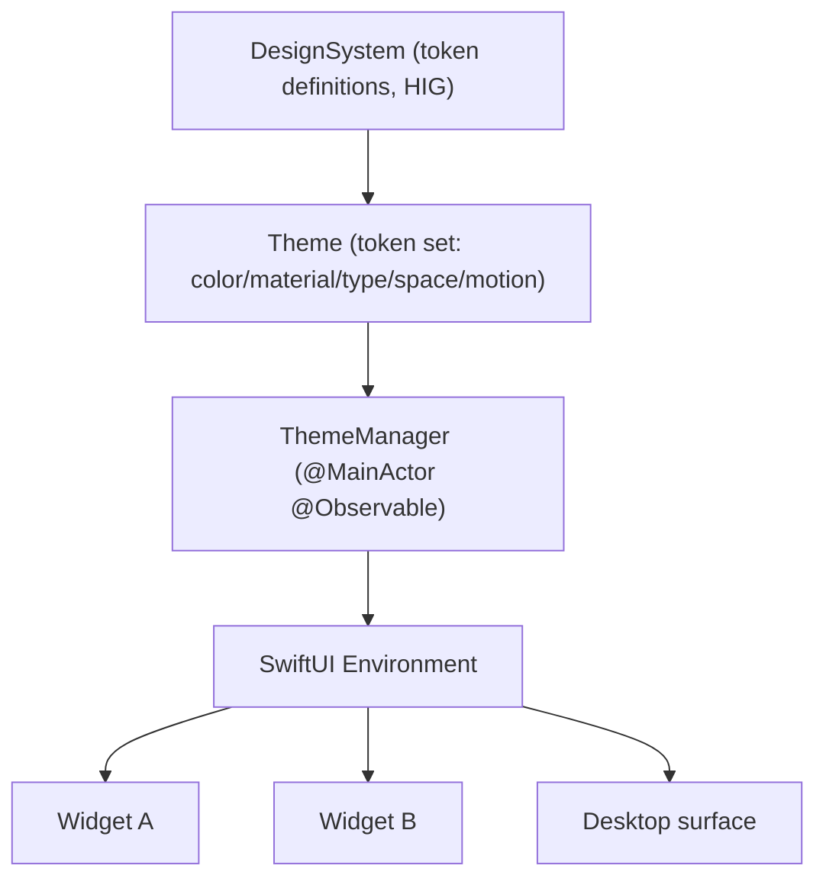

# Theme system architecture

The theme system is how a single source of design intent — colours, materials, type, spacing, motion — flows to every widget and surface, so the product looks coherent, respects the system appearance, and can be re-skinned (by the user, and eventually by third parties) without each widget hard-coding its own look. It is the runtime engine; the *visual language* it carries is owned by [DesignSystem](../Design/DesignSystem.md).

## Purpose and scope

In scope: appearance modes (light/dark/glass/blur), accent colours, typography, spacing, iconography, animation tokens, theme inheritance, and custom themes. Out of scope: the specific token values and HIG rationale ([DesignSystem](../Design/DesignSystem.md)) and how tokens become pixels ([RenderingEngine](RenderingEngine.md)).

## Context

Without a theme system, every widget invents its own colours and metrics, the surface looks incoherent, and "dark mode" or "increase contrast" must be re-implemented per widget. A token-based theme that lives in the environment solves all three: one definition, observed everywhere, swappable at runtime.

## Design

### Tokens, not values

A theme is a set of semantic **design tokens** — named roles, not raw values: `surface`, `surfaceSecondary`, `accent`, `textPrimary`, `textSecondary`, `separator`, plus material (glass/blur level), corner radius, spacing scale, type scale, and the animation constants. Widgets reference tokens (`theme.accent`), never literals (`Color.blue`), so changing the theme changes every widget at once and accessibility adjustments apply globally.

Tokens flow from the design system through the active theme and the `ThemeManager` into the environment, where every widget and the surface read them.

### Distribution through the environment

The active theme is held by a `ThemeManager` (`@MainActor @Observable`, [ADR-0003](../Decisions/ADR-0003-observable-state-model.md)) and injected into the SwiftUI environment ([DependencyInjection](DependencyInjection.md)). A widget reads the theme from the environment; when the theme changes, property-level observation re-renders only what actually depends on the changed token. Theme changes also fan out as `AppConstants.Notifications.themeDidChange` for non-SwiftUI consumers (e.g. a Metal wallpaper that tints to the accent colour).

### Appearance modes and system integration

Appearance follows the system by default (light/dark via `NSApp.effectiveAppearance`) and can be overridden. "Glass" and "blur" are material tokens implemented with native vibrancy/`NSVisualEffectView` and SwiftUI materials (Liquid Glass where available), not hand-rolled translucency — so the surface adopts the platform look and its future evolution for free. Accent colour can follow the system accent or be set per theme.

### Typography, spacing, iconography

Type uses semantic text styles mapped to the token type scale, which keeps Dynamic Type working ([AccessibilityStandards](../Standards/AccessibilityStandards.md)); widgets ask for `theme.type.title`, not a fixed point size. Spacing uses a token scale aligned to the 8-point grid (`AppConstants.Widget.snapGrid`). Icons use SF Symbols by default so they inherit weight, scale, and colour from the surrounding token context and render crisply at any scale.

### Inheritance and custom themes

Themes form an inheritance chain: a custom theme overrides only the tokens it cares about and inherits the rest from a base theme, so a user (or third-party theme) can change the accent and corner radius without redefining the whole palette. Custom themes are `Codable` documents persisted alongside layout ([ADR-0008](../Decisions/ADR-0008-persistence-strategy.md)); an invalid or partial theme resolves missing tokens from its base, never rendering an unstyled widget.

## Invariants

1. **Widgets reference tokens, never literal colours/metrics;** restyling is global ([DesignSystem](../Design/DesignSystem.md)).
2. **A theme always resolves every token** (via inheritance/base fallback); there is no unstyled state.
3. **Appearance, Dynamic Type, and contrast adjustments apply globally** through tokens, not per widget ([AccessibilityStandards](../Standards/AccessibilityStandards.md)).
4. **Materials use native vibrancy/SwiftUI materials,** not hand-rolled translucency.

## Data flow

System appearance / user choice → active `Theme` resolved (with inheritance) → `ThemeManager` `@Observable` state → environment → widgets/surface re-read changed tokens; `themeDidChange` notifies non-SwiftUI consumers.

## Alternatives and decisions

Token-based theming distributed via the environment rests on `@Observable` state ([ADR-0003](../Decisions/ADR-0003-observable-state-model.md)) and initializer/environment injection ([ADR-0005](../Decisions/ADR-0005-initializer-dependency-injection.md)). A future ADR will govern the public custom-theme schema when third-party theming opens, as it becomes a versioned contract like the widget config schema ([ADR-0010](../Decisions/ADR-0010-widget-configuration-schema-versioning.md)).

## Known limitations

- Third-party theme distribution is a public schema not yet specified; v1 supports user-authored themes only.
- A Tier-3 (Metal) widget must read tokens explicitly via the notification/observation bridge rather than the SwiftUI environment; the design system provides a token-snapshot value for that path.

## Future evolution

When theming opens to third parties, the inheritance model and `Codable` theme document are the contract; signing/validation joins the same path as plugins. Per-widget theme overrides (one widget on a different accent) are a natural extension of the inheritance chain.

## Open questions

- Whether to ship a small curated set of built-in themes in v1 or only system-following light/dark plus user customisation.

## References

1. [DesignSystem](../Design/DesignSystem.md) · [ADR-0003](../Decisions/ADR-0003-observable-state-model.md) · [AccessibilityStandards](../Standards/AccessibilityStandards.md).
2. Apple, "Materials / NSVisualEffectView." https://developer.apple.com/documentation/appkit/nsvisualeffectview

## Completion checklist
- [x] Token model and environment distribution described.
- [x] Appearance modes, type, spacing, icons, inheritance, custom themes covered.
- [x] Invariants named; ADRs/standards linked.

## Review checklist
- [ ] Matches the ThemeManager implementation.
- [ ] Token names reconciled with DesignSystem.
- [ ] Meets DocumentationStandards.
