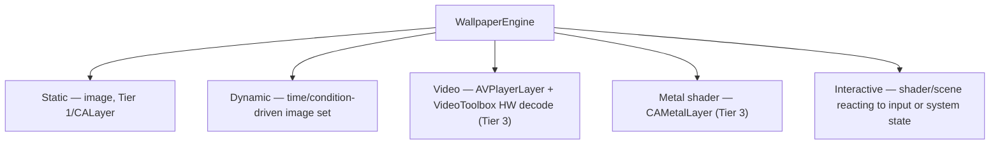
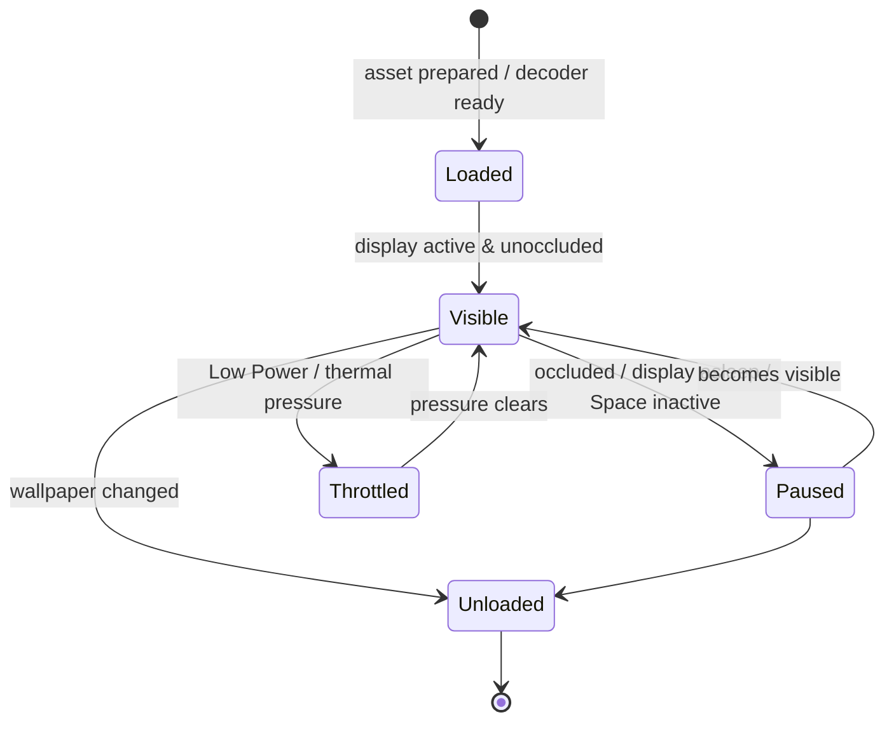

# Wallpaper engine architecture

The wallpaper engine renders the bottom-most layer of the surface — from a static image to a Metal shader — under the same always-on budget as everything else, and it is the surface's largest potential energy consumer, so its whole design is shaped by "beautiful at negligible battery cost."

## Purpose and scope

In scope: static, dynamic, video, Metal-shader, and interactive wallpapers; their rendering, synchronisation across displays, and lifecycle. Out of scope: the rendering tiers themselves ([RenderingEngine](RenderingEngine.md)) and per-display identity ([MultiMonitorArchitecture](MultiMonitorArchitecture.md)).

## Context

Wallpaper runs continuously behind everything, so a careless implementation spins fans and drains batteries — the exact failure [PerformanceStandards](../Standards/PerformanceStandards.md) forbids ("live wallpaper: negligible battery cost, via hardware decode"). The engine's job is to deliver liveliness while being aggressively lazy: do nothing when nothing is visible, decode in hardware, and throttle on power and thermal pressure.

## Design

### Wallpaper kinds

Wallpaper kinds and their rendering tier. Cost rises down the list; the engine runs each on the cheapest tier that expresses it ([ADR-0006](../Decisions/ADR-0006-tiered-rendering-strategy.md)).

- **Static** — a single image, drawn once into a backing layer; zero ongoing cost.
- **Dynamic** — an image set that changes with time of day, light/dark appearance, or a system condition; a scheduled swap with a cross-fade, near-zero cost between transitions.
- **Video** — looping video via `AVPlayerLayer` with VideoToolbox hardware decode; never software decode. Paused entirely when not visible.
- **Metal shader** — a `CAMetalLayer` driven by the display clock; the most expensive kind, GPU-capped by the rendering engine.
- **Interactive** — a shader or scene that reacts to cursor, audio, or a system metric; runs the shader path only while a source is active and visible.

### Rendering and synchronisation

Each display has its own wallpaper bound to its display identity ([ADR-0009](../Decisions/ADR-0009-per-display-independent-layouts.md)); a wallpaper can be unique per display or one logical wallpaper spanning displays. When spanning, frames are synchronised to a single logical clock so motion is coherent across monitors rather than drifting. The wallpaper layer is the bottom of the compositor stack the [RenderingEngine](RenderingEngine.md) commits.

### Lifecycle and laziness

Wallpaper lifecycle. The engine pauses decode and rendering whenever the wallpaper is not actually seen, and throttles frame rate under power/thermal pressure.

A fully occluded wallpaper (a maximised opaque window covering the display) is paused — there is no reason to decode frames no one can see. *(Inference: reliable full-occlusion detection across Spaces and full-screen apps is validated empirically in the wallpaper milestone; the conservative fallback is to pause on display sleep and Space-inactive only.)*

### Power and thermal behaviour

The engine subscribes to power-source and thermal state ([SystemServices](SystemServices.md)): on battery or under thermal pressure it lowers video/shader frame rate and may freeze to a poster frame, honouring Low Power Mode. This is the concrete mechanism behind the "negligible battery cost" budget line.

## Invariants

1. **No software decode in the hot path;** video uses VideoToolbox hardware decode ([PerformanceStandards](../Standards/PerformanceStandards.md)).
2. **An unseen wallpaper does no work** (paused on sleep/occlusion/inactive Space).
3. **Spanning wallpaper is frame-synchronised** across displays.
4. **The engine honours system power and thermal state,** throttling rather than ignoring it.

## Data flow

Wallpaper config (per display, from the layout document) → asset/decoder preparation → display-clock-driven frames (only while visible) → bottom of the compositor. Power/thermal/visibility signals gate the frame production.

## Alternatives and decisions

Hardware decode and the tiered rendering of wallpaper are [ADR-0006](../Decisions/ADR-0006-tiered-rendering-strategy.md) and [PerformanceStandards](../Standards/PerformanceStandards.md). Per-display binding is [ADR-0009](../Decisions/ADR-0009-per-display-independent-layouts.md).

## Known limitations

- Full-occlusion detection is observed behaviour; the conservative fallback over-renders slightly rather than risk a black wallpaper.
- Interactive wallpapers that react to audio need microphone permission ([SecurityStandards](../Standards/SecurityStandards.md)) requested at point of use; that capability is gated and off by default.

## Future evolution

Interactive and reactive wallpapers are the growth area; the lifecycle and power model here keep them affordable. Third-party shader wallpapers arrive through the same plugin capability path as Tier-3 widgets ([PluginSDK](PluginSDK.md)).

## Open questions

- Whether dynamic-wallpaper transitions should align to system appearance changes exactly or lead them slightly for smoothness — a UX call with [Design](../Design/DesignSystem.md).

## References

1. [ADR-0006](../Decisions/ADR-0006-tiered-rendering-strategy.md) · [PerformanceStandards](../Standards/PerformanceStandards.md) · [RenderingEngine](RenderingEngine.md).
2. Apple, "AVPlayerLayer." https://developer.apple.com/documentation/avfoundation/avplayerlayer
3. Apple, "ProcessInfo thermalState / lowPowerModeEnabled." https://developer.apple.com/documentation/foundation/processinfo

## Completion checklist
- [x] Wallpaper kinds and tiers described.
- [x] Synchronisation, lifecycle, and laziness described.
- [x] Power/thermal behaviour stated.
- [x] Invariants named; ADRs linked.

## Review checklist
- [ ] Matches the wallpaper engine implementation.
- [ ] Battery cost verified with Instruments on battery.
- [ ] Meets DocumentationStandards.
