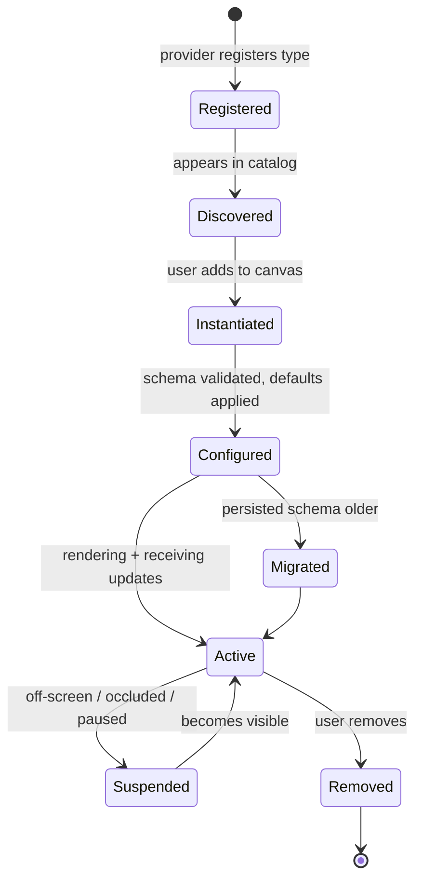

# Widget engine architecture

The widget engine owns the life of a widget: how it is registered and discovered, instantiated and rendered, configured and persisted, updated and animated, and — when it is third-party — isolated and supervised. It is the subsystem where the product's "surface" and its eventual "platform" meet, so its boundaries are drawn for third-party widgets from the start even while v1 ships first-party ones.

## Purpose and scope

In scope: widget lifecycle, registration, discovery, rendering integration, configuration, persistence, layout, host↔widget communication, events, animation, the performance contract, and the SDK/security/sandbox/marketplace seam. Out of scope: pixel mechanics ([RenderingEngine](RenderingEngine.md)), surface input ([DesktopEngine](DesktopEngine.md)), and the public SDK surface in full ([PluginSDK](PluginSDK.md)).

## Context

Widgets are the unit users add, arrange, and operate, and the unit third parties will ship. Three forces shape the engine: an always-on [performance budget](../Standards/PerformanceStandards.md) (a widget renders in under 8 ms at 120 Hz; idle CPU is near zero), reliability (one bad widget must not take down the surface), and an open boundary (the host must validate, configure, and migrate widgets it did not author). The first two argue for tight host control of the update loop; the third argues for a constrained, versioned contract — both are designed in below.

## Design

### Widget model

A widget is a `Sendable` identity-plus-configuration value (`Widget`: stable `id`, type identifier, frame on the canvas, `configSchemaVersion`, typed configuration) plus a renderable supplied by its provider. The value is what persists; the renderable is reconstructed from it.

### Lifecycle

Widget lifecycle. Registration and discovery are type-level; instantiation onward is per placed widget. Suspension is the key performance state — an unseen widget does no work.

### Registration and discovery

A widget *type* is registered with the engine through the provider protocol: first-party types at startup, third-party types when their plugin is loaded ([PluginSDK](PluginSDK.md)). Registration contributes the type's metadata — display name, category, default size, capability requirements, and its configuration schema ([ADR-0010](../Decisions/ADR-0010-widget-configuration-schema-versioning.md)) — to a catalog the UI browses. Discovery is the catalog lens; it never instantiates a widget, so browsing is cheap.

### Configuration and persistence

Each type declares a typed, versioned configuration schema ([ADR-0010](../Decisions/ADR-0010-widget-configuration-schema-versioning.md)). On load the engine validates persisted configuration against the installed schema, applies defaults for missing fields, and invokes the type's migration hook when the persisted `configSchemaVersion` is older. Invalid or unmigratable configuration falls back to defaults with a non-destructive notice — never a crash, never a dropped layout. The schema also drives an auto-generated settings panel, so a widget gets configuration UI for free. Persistence is part of the per-display layout document ([ADR-0008](../Decisions/ADR-0008-persistence-strategy.md), [ADR-0009](../Decisions/ADR-0009-per-display-independent-layouts.md)).

### The update loop and performance contract

The engine, not the widget, owns the frame schedule. Widgets declare *what* they need (a data source, a refresh cadence) and the engine decides *when* to run them:

- **Cadence is coalesced.** Updates are batched per frame; the engine caps concurrency at `AppConfiguration.maxConcurrentWidgetUpdates` (default 8) so a burst of widgets cannot drop frames.
- **Suspension is real.** A widget that is off-screen, on an inactive Space, or occluded has its data subscription suspended and does no rendering or polling ([DataFlow](DataFlow.md)).
- **One transaction per frame.** Layout and compositing happen once per frame, not once per widget ([PerformanceStandards](../Standards/PerformanceStandards.md)).
- **System data is shared.** Ten CPU widgets read one `CPUService` snapshot, not ten polls ([SystemServices](SystemServices.md)).

### Rendering integration

Widgets render in the tiered model ([ADR-0006](../Decisions/ADR-0006-tiered-rendering-strategy.md)): Tier 1 (SwiftUI) by default, escalating to Core Animation or Metal only on a measured need and, for third-party widgets, only with a granted capability. The engine hands a widget a bounded render context; a widget cannot draw outside its frame or into another widget. Animation uses the shared timing constants (`AppConstants.Animation`) so motion is consistent and `Reduce Motion` is honoured centrally ([AccessibilityStandards](../Standards/AccessibilityStandards.md)).

### Communication and events

Host→widget: configuration, lifecycle calls (activate/suspend/teardown), and data snapshots. Widget→host: layout requests (preferred size), capability requests, and user-action callbacks. For first-party widgets these are in-process protocol calls; for third-party widgets they cross XPC as serialized messages ([ADR-0007](../Decisions/ADR-0007-out-of-process-plugin-isolation.md)). Lifecycle facts fan out as `AppConstants.Notifications` (`widgetDidAdd`/`Remove`/`Update`).

### Isolation, security, sandbox, marketplace

Third-party widgets run out of process in sandboxed XPC services, each with only the entitlements it declared and the user granted ([ADR-0007](../Decisions/ADR-0007-out-of-process-plugin-isolation.md), [SecurityStandards](../Standards/SecurityStandards.md)). The engine supervises these processes — launch, health-check, restart on crash, and enforce resource caps — so a hung or crashing widget is contained and recoverable, not fatal. The marketplace is the distribution channel for these signed, sandboxed bundles; the engine's registration/discovery/config/version machinery is exactly what a marketplace install plugs into. The full SDK surface is [PluginSDK](PluginSDK.md).

## Invariants

1. **A widget does no work while suspended** (off-screen/occluded/inactive Space).
2. **A widget renders only within its own frame;** it cannot draw into the surface or another widget.
3. **One bad widget cannot crash the surface** — third-party widgets are out-of-process and supervised ([ADR-0007](../Decisions/ADR-0007-out-of-process-plugin-isolation.md)).
4. **Invalid/unmigratable config falls back to defaults,** never crashes or drops the layout ([ADR-0010](../Decisions/ADR-0010-widget-configuration-schema-versioning.md)).
5. **The host owns the frame schedule;** widgets request, the engine decides.

## Data flow

Registration → catalog → instantiation → schema-validated configuration → active render/update under the host schedule → suspend/resume by visibility → removal. System data arrives as shared `Sendable` snapshots; user actions return as callbacks; persistence is the per-display layout document.

## Alternatives and decisions

Out-of-process isolation: [ADR-0007](../Decisions/ADR-0007-out-of-process-plugin-isolation.md). Config schema and versioning: [ADR-0010](../Decisions/ADR-0010-widget-configuration-schema-versioning.md). Tiered rendering: [ADR-0006](../Decisions/ADR-0006-tiered-rendering-strategy.md). An in-process-only widget model was rejected for failing the reliability and security invariants.

## Known limitations

- High-frequency third-party rendering across XPC needs a shared-surface (`IOSurface`) path not yet specified ([PluginSDK](PluginSDK.md)); first-party Tier-3 widgets may run in-process during early milestones.
- An in-process fast path for first-party widgets is an open trade-off ([Architecture](Architecture.md) open questions).

## Future evolution

The engine's contract is the marketplace contract. Hardening the XPC schema, signing/notarisation of widget bundles, and the shared-surface render path are the steps from "first-party widgets" to "open platform," and they extend this engine rather than replace it.

## Open questions

- Per-metric: suspend by cancellation or by throttling? ([DataFlow](DataFlow.md))
- The resource-cap policy (CPU/memory per widget process) and its enforcement mechanism.

## References

1. [ADR-0007](../Decisions/ADR-0007-out-of-process-plugin-isolation.md) · [ADR-0010](../Decisions/ADR-0010-widget-configuration-schema-versioning.md) · [PerformanceStandards](../Standards/PerformanceStandards.md).
2. Apple, "XPC." https://developer.apple.com/documentation/xpc

## Completion checklist
- [x] Lifecycle, registration, discovery described and diagrammed.
- [x] Configuration, schema, migration, and persistence described.
- [x] Update loop and performance contract stated.
- [x] Isolation/security/sandbox/marketplace seam described.
- [x] Invariants named; ADRs linked.

## Review checklist
- [ ] Matches the widget engine implementation.
- [ ] Performance contract verified with Instruments.
- [ ] Meets DocumentationStandards.
