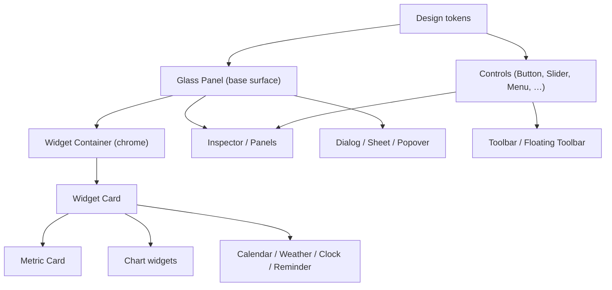

# Component architecture

The shared model behind every component: how a component is built from tokens, the common vocabulary of variants and states, how components compose, and the naming and handoff conventions. Defining this once keeps the eight family docs short and consistent — each only states where it diverges from the model here.

## Purpose and scope

In scope: the anatomy model, the variant and state vocabulary, sizing/spacing rules, composition, naming, and handoff conventions common to all components. Out of scope: per-component specs (the family docs) and the runtime token engine ([ThemeSystem](../Architecture/ThemeSystem.md)).

## Design principles

- **Token-built, never literal.** A component reads colour, type, spacing, radius, material, and motion from tokens ([DesignTokens](../Design/DesignTokens.md)); it hard-codes nothing, so it restyles globally and is accessible by default.
- **Composition over variants.** Prefer composing small components (a Widget Card is a Glass Panel + header + content) over a component with many flags. Fewer primitives, combined.
- **One behaviour per state.** The state vocabulary below means the same thing on every component, so users and engineers learn it once.

## Component hierarchy

Most surfaces descend from the Glass Panel; most information widgets descend from the Widget Card; controls are tokenised primitives used throughout. *(Diagram: the composition tree of the component library.)*

## Anatomy

A component is described by its **slots** (named regions: leading icon, title, content, trailing accessory, footer), its **container** (the surface and its material/radius/border), and its **affordances** (what appears on hover/selection/focus). A family doc lists each component's slots; engineers map slots to SwiftUI subviews ([EngineeringHandoff](../Design/EngineeringHandoff.md)).

## State vocabulary

The same nine states across the library; a component implements the subset that applies:

| State | Meaning | Token cue |
|---|---|---|
| Rest | Default | base surface/colour |
| Hover | Pointer over (affordances may reveal) | subtle border/elevation step, `motion.fast` |
| Pressed | Active press | brief inset/darken |
| Selected | Chosen / current | `accent` ring + slight lift |
| Focused | Keyboard focus | `accent` focus ring (always visible) |
| Disabled | Not available | `textTertiary` / reduced opacity, no affordances |
| Loading | Awaiting data | skeleton or inline progress ([StatesAndFeedback](StatesAndFeedback.md)) |
| Empty | No content yet | empty-state pattern |
| Error | Failed | inline error pattern, `danger` + icon/label |

Selected and focused are distinct (a component can be focused but not selected) and both visible at once when they coincide.

## Variants

Variants are intent-based, not look-based: a Button is `primary | secondary | tertiary | destructive | icon`, not "blue button". Variant changes which tokens resolve, never adds a new primitive. Each family doc enumerates its component's variants.

## Sizing and spacing

- Components size to a small set of **size classes** (e.g. control `small | regular | large`; widget `compact | regular | expanded`) rather than arbitrary dimensions.
- Internal spacing uses the spacing scale ([LayoutAndSpacing](../Design/LayoutAndSpacing.md)); content padding defaults to `m`, dense widget chrome to `widgetPadding (12)`.
- Hit targets meet the platform minimum regardless of visual size; icon-only controls keep a full-size target.

## Composition rules

- A component never reaches outside its slots to style its parent.
- Shared chrome (selection ring, hover affordances) is provided by the container (Widget Container, Glass Panel), not re-implemented per widget.
- Features never import each other's components; shared components live in the library and flow downward ([FolderStructure](../Standards/FolderStructure.md), [ADR-0004](../Decisions/ADR-0004-layered-architecture-dependency-rule.md)).

## Naming conventions

- Components are `UpperCamelCase` nouns matching this catalogue (`WidgetCard`, `GlassPanel`), per [NamingConventions](../Standards/NamingConventions.md).
- Variants are enums (`ButtonStyle.primary`), states are derived, not stringly-typed.
- Slot and accessory names match across the library (`leadingIcon`, `trailingAccessory`, `footer`).

## Handoff conventions

Each family doc carries a short handoff note; the full guidance (SwiftUI vs AppKit, animation, performance, a11y, testing, dependencies) is centralised in [EngineeringHandoff](../Design/EngineeringHandoff.md). Default: SwiftUI for content and controls; AppKit (`NSViewRepresentable`, `NSVisualEffectView`, `NSPanel`) only where SwiftUI lacks the capability ([ADR-0001](../Decisions/ADR-0001-appkit-window-swiftui-content.md)).

## Accessibility

The state vocabulary maps to accessibility traits (selected, disabled, focused); the container supplies the grouped accessibility element so a widget reads as one thing with controls inside ([AccessibilityDesign](../Design/AccessibilityDesign.md)). Focus is always visible; every control is keyboard-reachable.

## Performance

Composition from cheap, token-reading primitives keeps body evaluation small; shared chrome avoids per-widget blur/shadow stacking ([MaterialsAndElevation](../Design/MaterialsAndElevation.md)). Lists and galleries are lazy ([swiftui-performance] guidance in [EngineeringHandoff](../Design/EngineeringHandoff.md)).

## Trade-offs

- Composition over flags means more small types; the payoff is testability and consistency.
- A fixed state/variant vocabulary constrains one-off designs; that constraint is what makes the library coherent.

## Future evolution

The library is the foundation third-party widgets build on; the slot model and state vocabulary become the public component contract as the SDK opens ([PluginSDK](../Architecture/PluginSDK.md)). A SwiftUI preview gallery and snapshot tests per component are the natural CI extension.

## Open questions

- Whether to expose a subset of these primitives directly to plugin authors or only via higher-level widget templates.

## References

1. [DesignTokens](../Design/DesignTokens.md) · [EngineeringHandoff](../Design/EngineeringHandoff.md) · [NamingConventions](../Standards/NamingConventions.md) · [ADR-0001](../Decisions/ADR-0001-appkit-window-swiftui-content.md).
2. Apple, "HIG — Components." https://developer.apple.com/design/human-interface-guidelines/components

## Completion checklist
- [x] Anatomy, state, and variant vocabulary defined once.
- [x] Sizing, composition, naming, and handoff conventions stated.
- [x] Component-hierarchy diagram included.

## Review checklist
- [ ] Vocabulary reconciled with the family docs and EngineeringHandoff.
- [ ] Naming reconciled with NamingConventions.
- [ ] Meets DocumentationStandards.
