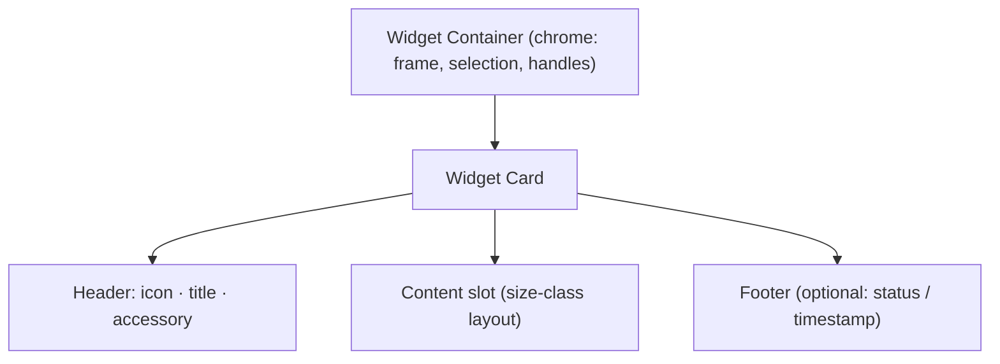

# Widgets

The built-in information widgets — Calendar, Reminder, Weather, and Clock — and the shared anatomy every widget (built-in or third-party) follows. They are the content inside a Widget Card ([Surfaces](Surfaces.md)); their lifecycle and configuration are owned by the [WidgetEngine](../Architecture/WidgetEngine.md), and their *interaction* (add/move/resize/configure) by [WidgetUX](../UX/WidgetUX.md). This doc specifies the content design of the four built-ins and the anatomy contract.

## Purpose and scope

In scope: widget anatomy and the four built-in information widgets. Out of scope: widget lifecycle/config schema ([WidgetEngine](../Architecture/WidgetEngine.md)), interaction ([WidgetUX](../UX/WidgetUX.md)), and live-metric widgets ([DataAndCharts](DataAndCharts.md)).

## Widget anatomy

Every widget is content in a Card in a Container; chrome and selection belong to the container, never the widget. *(Diagram: the layers of a widget.)* A widget defines compact / regular / expanded content layouts and switches by size class ([LayoutAndSpacing](../Design/LayoutAndSpacing.md)).

## Shared widget rules

- **Configurable without code** ([principle 5](../Design/DesignPhilosophy.md)): every widget is set up through the inspector/config, never a file.
- **Calm and peripheral:** widgets inform at a glance; none animates or badges to demand attention.
- **Token-built and accessible by default:** content reads tokens; the widget is one grouped a11y element with a clear label ([AccessibilityDesign](../Design/AccessibilityDesign.md)).
- **Permission-aware:** a widget needing data access (Calendar, Reminders, Location) shows a clear permission-needed empty state until granted ([SystemServices](../Architecture/SystemServices.md), [StatesAndFeedback](StatesAndFeedback.md)).

## Calendar

- **Purpose.** Upcoming events at a glance (EventKit).
- **Variants.** Day list · Week grid · Next-event.
- **States.** Rest · Loading · Permission-needed (empty) · No-events (empty) · Error.
- **Sizing.** Compact = next event; regular = today's list; expanded = multi-day.
- **Accessibility.** Events read as "title, time"; all-day distinguished by label; navigable list.
- **Animation.** List updates `motion.fast`; no animation on idle.
- **Performance.** Reads via the calendar service (60 s cadence); no per-frame work.
- **Guidelines.** Today-first; relative times ("in 20 min") via `FormatStyle`; respect calendar colours as a secondary cue, not the only one.

## Reminder

- **Purpose.** Open reminders / tasks (EventKit Reminders).
- **Variants.** Due-today · All-open · Single list.
- **States.** Rest · Loading · Permission-needed · Empty (all done) · Error.
- **Accessibility.** Each item exposes title, due, and completion; completion toggle is keyboard-operable.
- **Interaction.** Check off inline (an allowed lightweight write); honours undo.
- **Guidelines.** Celebrate "all done" with a quiet empty state, not confetti; overdue uses `warning` + icon.

## Weather

- **Purpose.** Current conditions and short forecast.
- **Variants.** Current-only · Current + hourly · Current + daily.
- **States.** Rest · Loading · Location/permission-needed · Error/stale (last-known with timestamp).
- **Accessibility.** Conditions read as text ("Cloudy, 14 degrees"); icons labelled; not colour-only.
- **Animation.** Condition changes cross-fade `motion.fast`; no looping weather animation on the surface (calm).
- **Performance.** Networked source on a sensible interval with caching; shows stale-with-timestamp rather than blocking.
- **Guidelines.** Units follow system locale; degrade gracefully offline; attribution per the data source.

## Clock

- **Purpose.** Time (and optionally date / additional time zones).
- **Variants.** Digital · Analog · World (multiple zones).
- **States.** Rest (always available; no data dependency).
- **Sizing.** Compact = time; regular = time + date; expanded = multi-zone.
- **Accessibility.** Time exposed as a value updated politely (not announced every second); analog has a text equivalent.
- **Animation.** Digital uses monospaced digits (no jitter); analog hands move smoothly but cheaply; Reduce Motion → stepped second hand or none.
- **Performance.** Drives off a timer at the needed granularity (minute for date, second only if a seconds display is shown); never a per-frame redraw for a static minute.
- **Guidelines.** 12/24-h and zone follow system locale; analog ticks are calm, not loud.

## Trade-offs

- Built-in widgets are intentionally shallow in features (no full calendar management) to stay calm and cheap; deeper management is the source app's job.
- Caching/stale-with-timestamp trades absolute freshness for resilience offline; appropriate for ambient widgets.

## Future evolution

More built-ins (notes, stocks, now-playing) follow the same anatomy; all of them, and third-party widgets, inherit the container/card/size-class model and the permission/empty/error patterns. The anatomy contract here becomes the SDK's widget template ([PluginSDK](../Architecture/PluginSDK.md)).

## Open questions

- Whether inline writes (checking a reminder) belong in v1 or are read-only until the permission model is finalised.

## References

1. [WidgetEngine](../Architecture/WidgetEngine.md) · [Surfaces](Surfaces.md) · [WidgetUX](../UX/WidgetUX.md) · [SystemServices](../Architecture/SystemServices.md).
2. Apple, "EventKit." https://developer.apple.com/documentation/eventkit
3. Apple, "HIG — Widgets." https://developer.apple.com/design/human-interface-guidelines/widgets

## Completion checklist
- [x] Widget anatomy and four built-ins specified against the schema.
- [x] Permission/empty/error and calm-update rules stated.
- [x] Widget-anatomy diagram included.

## Review checklist
- [ ] Reconciled with WidgetEngine config schema and SystemServices.
- [ ] Permission empty states verified with VoiceOver.
- [ ] Meets DocumentationStandards.
