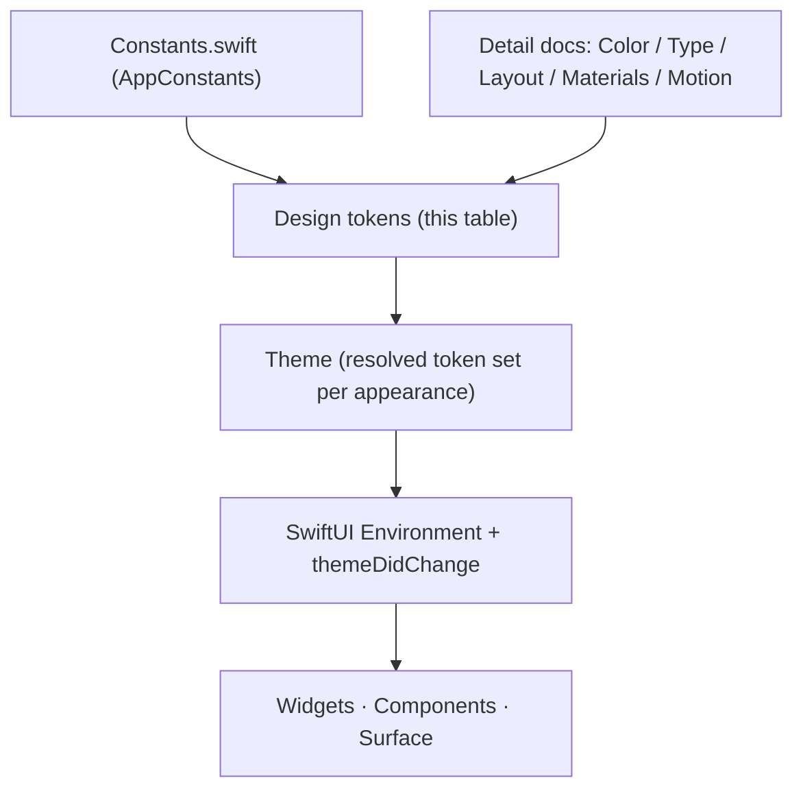

# Design tokens

The single reference for every token in Desktop Frame: its name, its value or resolution, and the code constant it shares a source with. Tokens are **semantic roles**, not raw values ([ADR-0012](../Decisions/ADR-0012-semantic-design-token-architecture.md)); the detail and rationale per group live in the dedicated docs, and this is the flat lookup that ties them together and to the code. [DesignSystem](DesignSystem.md) owns the taxonomy; this owns the table, the naming rules, and asset organisation.

## Purpose and scope

In scope: the consolidated token table, token naming conventions, the design-token-system structure, and asset organisation. Out of scope: per-group rationale (the linked detail docs) and runtime distribution ([ThemeSystem](../Architecture/ThemeSystem.md)).

## The token system

Tokens draw their geometry/motion values from `AppConstants` and their meaning from the detail docs; the theme resolves them per appearance; the environment delivers them. One source, one vocabulary, applied everywhere. *(Diagram: how a token value flows from code and design to the screen.)*

## Token naming

- **Role, not value:** `accent`, `surface`, `card` — never `blue`, `gray16`, `radius16`.
- **lowerCamelCase**, grouped by a leading domain when addressed in code: `theme.color.accent`, `theme.type.title`, `theme.space.m`, `theme.radius.card`, `theme.motion.default`.
- **Scale tokens use t-shirt sizes** (`xs/s/m/l/xl`) for spacing, **named roles** for everything semantic.
- A token name never encodes appearance (`accentDark` is wrong); appearance is a *resolution* of the one token ([ColorSystem](ColorSystem.md)).

## Token reference

### Colour ([ColorSystem](ColorSystem.md))
| Token | Default resolution |
|---|---|
| `color.surface` / `surfaceSecondary` | `windowBackgroundColor` / `underPageBackgroundColor` |
| `color.textPrimary` / `Secondary` / `Tertiary` | `labelColor` / `secondaryLabelColor` / `tertiaryLabelColor` |
| `color.accent` / `onAccent` | `controlAccentColor` / contrast pair |
| `color.separator` | `separatorColor` |
| `color.success` / `warning` / `danger` | system green / yellow / red |

### Type ([Typography](Typography.md))
| Token | Maps to |
|---|---|
| `type.display` / `title` / `headline` | Large Title / Title / Headline |
| `type.body` / `callout` / `caption` | Body / Callout / Caption |
| `type.mono` | Body, monospaced design / monospaced digits |

### Spacing ([LayoutAndSpacing](LayoutAndSpacing.md))
| Token | Value | Code anchor |
|---|---|---|
| `space.xs` / `s` / `m` / `l` / `xl` | 4 / 8 / 16 / 24 / 32 | `Widget.snapGrid = 8` |
| `space.widgetPadding` | 12 | `Widget.padding`, `Window.defaultPadding` |
| `space.margin` | 20 | `Window.defaultMargin` |

### Radius ([MaterialsAndElevation](MaterialsAndElevation.md))
| Token | Value | Code anchor |
|---|---|---|
| `radius.card` | 16 | `Window.defaultCornerRadius = 16` |
| `radius.control` | 8 | 8-pt grid |
| `radius.pill` | height / 2 | — |

### Material & elevation ([MaterialsAndElevation](MaterialsAndElevation.md))
| Token | Resolution |
|---|---|
| `material.glass` / `blur` / `opaque` | `.regularMaterial` / `.thickMaterial` / solid `surface` |
| `elevation.0…3` | surface / resting / floating / modal |

### Motion ([MotionSystem](MotionSystem.md))
| Token | Value | Code anchor |
|---|---|---|
| `motion.fast` / `default` / `slow` | 0.15 / 0.30 / 0.60 s | `Animation.fastDuration / defaultDuration / slowDuration` |
| `motion.springResponse` / `springDamping` | 0.40 / 0.82 | `Animation.springResponse / springDamping` |

### Icon ([Iconography](Iconography.md))
| Token | Resolution |
|---|---|
| `icon.set` | SF Symbols; weight/scale inherited from context |

## Asset organisation

- **Symbols:** SF Symbols by name; the few custom symbols are SVG-templated and live in `Assets.xcassets` as symbol images so they inherit weight/scale ([Iconography](Iconography.md)).
- **Colours:** named colour assets only for theme-authored palettes; system-colour-backed roles are resolved in code, not as assets.
- **Images/illustrations:** in `Assets.xcassets`, with light/dark and @1x/@2x variants; named by role (`empty-widgets`, not `illustration1`).
- **Naming:** asset names are kebab-case roles matching the token/component they serve, so an asset is traceable to its use.

## Accessibility

Every token resolves correctly under the system accessibility settings *because* it is a role: appearance, contrast, Dynamic Type, Reduce Motion, and Reduce Transparency are applied at resolution time, globally ([AccessibilityDesign](AccessibilityDesign.md)). Hard-coding a value opts out and fails review.

## Performance

Token values are resolved once per theme change and cached; nothing here is computed per frame ([ThemeSystem](../Architecture/ThemeSystem.md)). Motion tokens are the same constants the render loop uses, so design and runtime never disagree on timing.

## Trade-offs

- A flat reference table can drift from the detail docs; it is kept minimal and links each group to its owner, and the code-anchored values are the tiebreak.
- Sharing values with `AppConstants` couples design tokens to shipping code; that coupling is the point ([ADR-0012](../Decisions/ADR-0012-semantic-design-token-architecture.md)).

## Future evolution

When third-party theming opens, this table becomes the public, versioned token vocabulary; new groups (depth, additional type roles) extend it additively ([ADR-0010](../Decisions/ADR-0010-widget-configuration-schema-versioning.md)). A generated token reference (from the code constants) could replace the hand-maintained anchors.

## Open questions

- Whether to auto-generate the code-anchored rows from `Constants.swift` to guarantee they never drift.

## References

1. [DesignSystem](DesignSystem.md) · [ADR-0012](../Decisions/ADR-0012-semantic-design-token-architecture.md) · [ThemeSystem](../Architecture/ThemeSystem.md) · [Constants.swift](../../desktop-frame/Core/Utilities/Constants.swift).
2. Apple, "HIG — Foundations." https://developer.apple.com/design/human-interface-guidelines/foundations

## Completion checklist
- [x] All token groups listed with values/resolutions and code anchors.
- [x] Naming and asset-organisation rules stated.
- [x] Token-system diagram included.

## Review checklist
- [ ] Code anchors verified against Constants.swift on each change.
- [ ] Token names reconciled across all detail docs and ThemeSystem.
- [ ] Meets DocumentationStandards.
