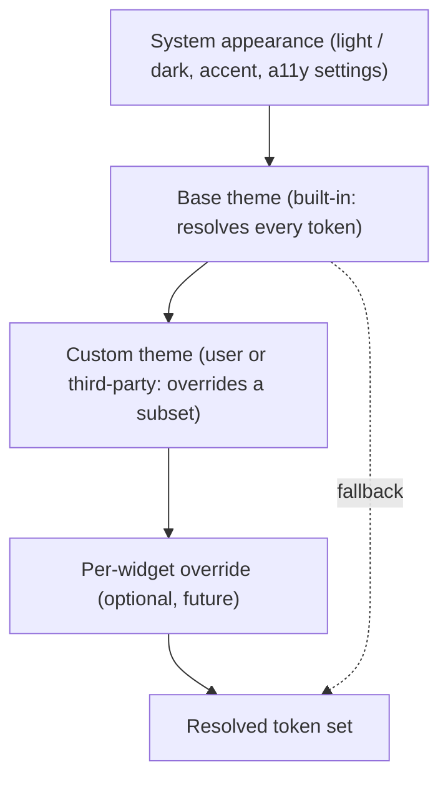

# Theme architecture (design)

The design-side view of theming: what a theme *is* as a design artifact, how custom themes inherit and override tokens, how brand identity fits, and how the token vocabulary is versioned as it becomes a public contract. This is the design counterpart to the runtime [ThemeSystem](../Architecture/ThemeSystem.md), which owns *how* a theme reaches the screen. The two are split so visual intent and rendering mechanism evolve independently ([DesignSystem](DesignSystem.md)).

## Purpose and scope

In scope: the theme as a design object, the inheritance/override model from the designer's side, custom-theme authoring rules, brand identity, and token versioning. Out of scope: the `ThemeManager`, environment distribution, and the `themeDidChange` path ([ThemeSystem](../Architecture/ThemeSystem.md)).

## Design principles

- **A theme is a token set, not a skin.** It supplies values for the semantic roles; it cannot add new visual primitives or bypass the token vocabulary ([ADR-0012](../Decisions/ADR-0012-semantic-design-token-architecture.md)).
- **Inherit, override sparingly.** A custom theme overrides only the tokens it cares about; everything else falls through to its base, so a theme is small and stays coherent.
- **Coherence is guaranteed, not hoped for.** Because every surface reads roles, a valid theme can never produce an unstyled or illegible widget — missing tokens resolve from the base, and contrast is validated ([ColorSystem](ColorSystem.md)).

## Theme hierarchy

Resolution walks from the most specific override down to the base, and any token left unset falls back to the base — so the resolved set is always complete. *(Diagram: the override chain that produces the final token set.)*

## Appearance, base, and custom themes

- **System default.** Out of the box, the base theme follows the system: light/dark via `effectiveAppearance`, accent via `controlAccentColor`. No theme choice is required to look native.
- **Base themes.** One or a small curated set of built-in themes, each resolving every token. They are the floor every custom theme inherits from.
- **Custom themes.** A user (and later a third party) authors a theme by overriding a subset of tokens — typically accent, surface tint, corner radius, maybe type emphasis. Authored as a `Codable` document persisted with layout ([ADR-0008](../Decisions/ADR-0008-persistence-strategy.md)). The design rules: every overridden colour declares its light/dark and high-contrast resolutions; overrides never break the contrast or Dynamic-Type guarantees; a theme may not remove a role.

## Brand identity in themes

Desktop Frame's own brand is deliberately light ([DesignPhilosophy](DesignPhilosophy.md) "visual identity"): the default theme expresses no strong brand colour, deferring to the user's content and system accent. Brand presence lives in marketing surfaces (marketplace, onboarding, app icon), not in the in-surface theme. A third party's brand, when theming opens, is expressed within the token vocabulary — they tint, they don't redesign — keeping every widget native regardless of author.

## Token versioning

The token vocabulary is a contract. Today it is internal; when third-party themes open it becomes public and versioned exactly like the widget config schema ([ADR-0010](../Decisions/ADR-0010-widget-configuration-schema-versioning.md)): new token groups are added additively, roles are never removed without a deprecation cycle, and a theme declares the vocabulary version it targets so old themes keep resolving. The semantic-role model is what makes this versioning tractable ([ADR-0012](../Decisions/ADR-0012-semantic-design-token-architecture.md)).

## Accessibility

A theme cannot opt out of accessibility: the override rules require valid contrast pairs and forbid removing roles, so appearance, contrast, Dynamic Type, Reduce Motion, and Reduce Transparency keep working under any theme ([AccessibilityDesign](AccessibilityDesign.md)). A theme that fails validation is rejected.

## Performance

Theme resolution happens once per theme change, not per frame; the resolved set is cached and distributed via the environment ([ThemeSystem](../Architecture/ThemeSystem.md)). Inheritance is resolved at load, so reads are flat lookups.

## Trade-offs

- Constraining themes to the token vocabulary limits how different a theme can look; this is exactly what guarantees coherence and accessibility, and is accepted.
- A small curated base-theme set adds design/maintenance cost versus a single system-following theme; the open question below.

## Future evolution

Per-widget theme overrides (one widget on a different accent) extend the inheritance chain naturally. Signed, distributable third-party themes join the same validation and versioning path as plugins ([PluginSDK](../Architecture/PluginSDK.md)). A theme marketplace is a long-term possibility once the vocabulary is public.

## Open questions

- Ship a curated built-in theme set in v1, or only system-following light/dark plus user customisation? (Mirrors the [ThemeSystem](../Architecture/ThemeSystem.md) open question.)

## References

1. [ThemeSystem](../Architecture/ThemeSystem.md) · [DesignTokens](DesignTokens.md) · [ADR-0012](../Decisions/ADR-0012-semantic-design-token-architecture.md) · [ADR-0010](../Decisions/ADR-0010-widget-configuration-schema-versioning.md).
2. Apple, "HIG — Dark Mode / Appearance." https://developer.apple.com/design/human-interface-guidelines/dark-mode

## Completion checklist
- [x] Theme-as-token-set model and inheritance defined.
- [x] Custom-theme rules, brand identity, and versioning stated.
- [x] Theme-hierarchy diagram included.

## Review checklist
- [ ] Inheritance model reconciled with ThemeManager implementation.
- [ ] Theme validation rules verified against contrast tooling.
- [ ] Meets DocumentationStandards.
