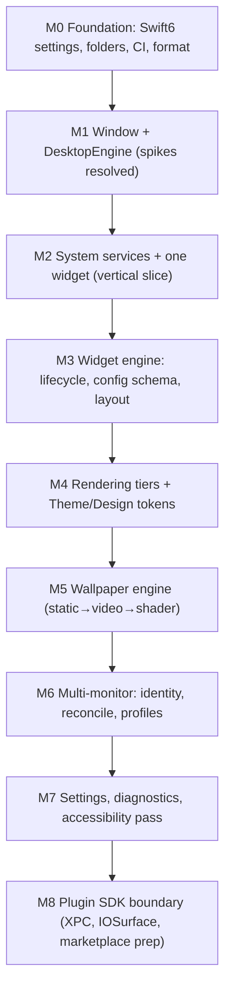

# Engineering readiness assessment (Phase 2)

The capstone of the architecture phase. It reviews the blueprint produced in Phase 2, judges whether implementation can begin without major redesign, and records the risks, missing research, recommended first sprint, implementation order, pre-coding technical debt, and architecture improvements. It is the bridge from "designed" to "buildable."

## Purpose and scope

In scope: a review of the Phase 2 architecture, a readiness verdict, and the seven forward-looking deliverables the phase requires. Out of scope: the architecture itself (the [Architecture](../Architecture/README.md) tree) and product strategy (Notion).

## 1. Architecture review

The blueprint is coherent and complete enough to build against. What was produced:

- **A whole-system architecture** ([Architecture](../Architecture/Architecture.md)) with four enforced layers, a documented concurrency model, and a consolidated invariant list.
- **Thirteen subsystem documents** covering clean-architecture mapping, data flow, DI, and the nine subsystems (window, desktop, widget, rendering, wallpaper, multi-monitor, theme, plugin SDK, system services).
- **Eleven ADRs** (0001–0011) that back-fill the scaffolding decisions and record the net-new ones, so every significant design choice has a canonical, immutable record.
- **Supporting engineering docs:** platform research with labelled claims, a testing strategy, a performance-engineering practice, and a design system.

Assessment of quality: the design is **internally consistent** (every subsystem doc links its governing ADRs; the invariant list is traceable to owners), **grounded in the existing code** (window levels, refresh cadences, the `@Observable` config, OSLog categories are cited, not invented), and **honest about uncertainty** (observed window-server behaviours are labelled and routed to spikes, not asserted as fact). The architecture is shaped by the product's hardest constraints — the always-on performance budget and the future plugin boundary — rather than by generic patterns.

The one structural caveat: several load-bearing behaviours depend on **observed, non-contracted macOS behaviour** (Spaces/Mission Control/Stage Manager/full-screen coexistence, per-region click-through). These are correctly identified and bounded, but they are the difference between "designed" and "proven," which is why Sprint 1 is spike-heavy.

## 2. Engineering readiness assessment

**Verdict: ready to begin implementation, conditional on the Sprint-1 spikes resolving the highest-risk platform assumptions before the dependent subsystems are committed.**

| Readiness dimension | State |
|---|---|
| Architecture defined | ✅ whole-system + 13 subsystems |
| Decisions recorded | ✅ ADR-0001…0011 canonical in git |
| Standards in place | ✅ performance/security/accessibility/code (pre-existing) |
| Testing approach | ✅ [TestingStrategy](../Development/TestingStrategy.md) |
| Build settings reconciled | ⚠️ ADR-0011 written; Xcode project change not yet applied |
| CI / gate automation | ❌ not yet (governance gap 4) |
| Platform assumptions proven | ⚠️ spikes pending (window milestone) |
| Source skeleton | ⚠️ planned Core subfolders not yet created |

Green where the blueprint is the deliverable; amber/red where execution work (project settings, CI, spikes, folders) is the next phase's job. None of the amber/red items is an architectural unknown — they are known, owned, and sequenced below.

## 3. Risks

Mirror to the Notion Risk Register (`RK-`); the highest are platform-behaviour risks.

| # | Risk | Likelihood | Impact | Mitigation | Owner |
|---|---|---|---|---|---|
| R1 | Observed window behaviour (Spaces/Mission Control/Stage Manager/full-screen) differs from inference on macOS 15 | Medium | High | Window-milestone spike before committing the window design; isolate behind `AppConstants.Window`; per-release re-verify checklist | Window System |
| R2 | Per-region click-through across the SwiftUI/AppKit seam proves infeasible | Medium | High | Desktop-engine spike; fallback to explicit edit-mode toggle (no per-region magic) | Principal Eng |
| R3 | Cross-process plugin rendering at high frame rate (no `IOSurface` design yet) blocks Tier-3 third-party content | Medium | Medium | Defer to SDK milestone; first-party Tier-3 in-process meanwhile | Plugin team |
| R4 | Performance budget unmet under real wallpaper + many widgets | Medium | High | Budget allocated per subsystem ([PerformanceEngineering](PerformanceEngineering.md)); measure from first widget; suspend-when-unseen by design | Performance |
| R5 | macOS update breaks an observed behaviour post-ship | Medium | High | No private API; behaviours isolated; per-release manual checklist; conservative fallbacks | Window System |
| R6 | Build-settings drift (Swift 6/macOS 15) persists and erodes the concurrency-safety claim | Low | High | Apply ADR-0011 reconciliation early; enforce via CI | Principal Eng |
| R7 | Composition root / manual DI grows unwieldy | Low | Low | Assembler decomposition ([DependencyInjection](../Architecture/DependencyInjection.md)) before any container | Principal Eng |

## 4. Missing research

The spikes that must precede the affected commitments ([MacOSPlatformResearch](../Research/MacOSPlatformResearch.md) open investigations):

1. **`collectionBehavior` combination** for desktop surface across Spaces and full-screen — blocks window design (R1).
2. **Per-region click-through** across the hosting seam — blocks the desktop-engine interaction model (R2).
3. **Sandbox-safe screen-capture detection** — blocks `hideWidgetsDuringScreenShare`.
4. **Full-occlusion detection** — refines wallpaper pausing (performance).
5. **`IOSurface` cross-process render path** — blocks third-party Tier-3 (R3); SDK milestone.
6. **GPU/thermal metric fidelity** across the supported chip range — blocks GPU widgets as a v1 feature.

## 5. Recommended Sprint 1

A spike-and-skeleton sprint that proves the riskiest assumptions and lays the foundation, producing a running desktop window with one widget — the thinnest end-to-end slice.

**Goal:** a single `DesktopWindow` on the main display, behind Finder icons, hosting one SwiftUI widget driven by one actor service, with layout persisted — and the two highest platform risks resolved.

| Item | Type | Closes |
|---|---|---|
| Apply ADR-0011: set Swift 6 / strict concurrency / macOS 15 in the Xcode project; log in Decision Log | Foundation | R6, gap 1 |
| Create the planned `Core/` subfolders (`Engine`, `Managers`, `Services`, `Window`, `Features`, `Models`) | Foundation | gap 3 |
| **Spike:** `collectionBehavior` for the desktop surface across Spaces/full-screen | Spike | R1, research #1 |
| **Spike:** per-region click-through across the hosting seam | Spike | R2, research #2 |
| `DesktopWindow` (`NSWindow` subclass) at `desktopLevel`, clear, one per main display | Build | — |
| One `actor` service (`CPUService`) with injected clock + unit test | Build | validates [ADR-0002](../Decisions/ADR-0002-actor-isolated-system-services.md) |
| One Tier-1 SwiftUI widget reading the service via a `@MainActor` manager | Build | validates [DataFlow](../Architecture/DataFlow.md) |
| Layout persistence round-trip (write/reload/migrate) with test | Build | validates [ADR-0008](../Decisions/ADR-0008-persistence-strategy.md) |
| Minimal CI: build + unit tests on PR | Foundation | gap 4 |
| Commit `.swift-format` at repo root | Foundation | gap 6 |

Exit criteria: the slice runs within the idle-CPU budget; the two spikes have a verdict (proceed or fall back); the build is green in CI under Swift 6.

## 6. Recommended implementation order

Dependency-ordered; each milestone builds on the proven layer below.

Implementation order. Foundation and the window/desktop layer first (highest risk, everything depends on them); the plugin SDK last (it depends on a stable widget engine and rendering pipeline). Multi-monitor follows the single-display slice so the reconcile logic is built against a working window system.

Rationale: front-load the platform risk (M1) because a failed window assumption invalidates the most downstream work; defer the SDK (M8) because its boundary is designed but should harden against a *working* system, not a hypothetical one.

## 7. Technical debt identified before coding

Recorded now so it is tracked, not discovered later. Mirror to the Notion Technical-Debt tracker (`TD-`).

| # | Debt | Origin | Resolution trigger |
|---|---|---|---|
| TD1 | Layer dependency rule enforced by review only, not the compiler | [ADR-0004](../Decisions/ADR-0004-layered-architecture-dependency-rule.md) | package extraction at SDK boundary |
| TD2 | XPC plugin message schema + `IOSurface` render path unspecified | [ADR-0007](../Decisions/ADR-0007-out-of-process-plugin-isolation.md) | SDK milestone (M8) |
| TD3 | Planned `Core/` subfolders not created; architecture references aspirational paths | [Architecture](../Architecture/Architecture.md) | M0 |
| TD4 | Xcode project still Swift 5 / lower target | [GovernanceAuditReport](GovernanceAuditReport.md) gap 1 | M0 (ADR-0011) |
| TD5 | No CI; performance/a11y gates asserted not automated | gap 4 | M0 (build+test), then perf smoke |
| TD6 | `.swift-format` not committed | gap 6 | M0 |
| TD7 | Legacy `FolderStructure.md` / `DevelopmentSetup.md` not yet moved into subfolders | hub migration note | next docs change with Notion Index update |
| TD8 | Untyped notification payloads (`userInfo`) | [DataFlow](../Architecture/DataFlow.md) | only if the notification channel grows |

## 8. Suggested improvements to the architecture

Forward-looking refinements, not blockers:

- **Graduate the dependency rule to a compiler guarantee** by extracting `Foundation`/`Core`/plugin-API into Swift packages earlier than the SDK milestone if M3 shows the boundaries are stable — turns TD1 from debt into a guarantee.
- **A small typed event bus** to replace `NotificationCenter` if the notification set grows past its current handful, resolving TD8 without sacrificing decoupling.
- **A render-budget assertion in debug builds** (`AppConfiguration.showDebugOverlay`) that flags a frame exceeding 8 ms or a second layout pass, making the [performance](PerformanceEngineering.md) tripwires runtime-visible during development.
- **A capability-manifest linter** for plugins, run at validation time, so a plugin requesting more than it uses is caught before listing ([PluginSDK](../Architecture/PluginSDK.md)).
- **Promote the manual platform checklist into a release script** that opens each scenario and prompts the verifier, so the per-release checks are consistent ([TestingStrategy](../Development/TestingStrategy.md)).

## Conclusion

The Phase 2 blueprint is detailed and internally consistent enough that implementation can begin without major architectural redesign, provided Sprint 1 resolves the two high-risk platform spikes (R1, R2) before the window and desktop subsystems are committed. Every significant decision is an ADR, every subsystem has a document, every budget line has an owner, and every known gap is tracked with a resolution trigger. The architecture is ready; the next phase is foundation, spikes, and the first vertical slice.

## References

1. [Architecture index](../Architecture/README.md) · [Decisions](../Decisions/README.md) · [MacOSPlatformResearch](../Research/MacOSPlatformResearch.md).
2. [GovernanceAuditReport](GovernanceAuditReport.md) — the gaps this assessment sequences.
3. [PerformanceEngineering](PerformanceEngineering.md) · [TestingStrategy](../Development/TestingStrategy.md).
