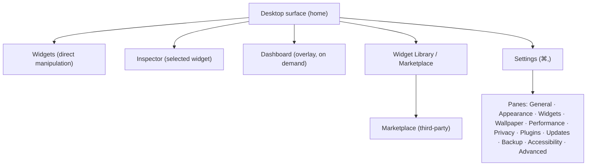

# Information architecture

How Desktop Frame is structured and navigated, the mental models it relies on, and how it keeps cognitive load low through progressive disclosure. IA is what makes a deeply customisable product still feel simple — every capability has an obvious home, and the first screen stays calm ([principle 4](../Design/DesignPhilosophy.md)).

## Purpose and scope

In scope: the product's structural map, navigation model, mental models, cognitive-load and progressive-disclosure strategy. Out of scope: the Settings pane detail ([SettingsUX](SettingsUX.md)) and step-by-step flows ([UserFlows](UserFlows.md)).

## Design principles

- **One obvious home per capability** ([FolderStructure](../Standards/FolderStructure.md) analogue for UX): a user never wonders which of two places a setting lives.
- **The surface is the product; everything else is in service of it.** The desktop is home; Settings, the library, and the Dashboard are supporting surfaces reached from it.
- **Disclose progressively:** common first, advanced one level deeper, expert behind a mode.

## The structural map

Three navigation layers: **the surface** (direct manipulation of widgets, always primary), **transient surfaces** (inspector, Dashboard, context menus — reached in-context), and **configuration** (Settings, library, marketplace — reached deliberately). *(Diagram: where every capability lives.)*

## Navigation model

- **In-place first.** Most actions happen on the surface via direct manipulation and context menus ([InteractionModel](InteractionModel.md)); the user rarely leaves home.
- **Deliberate surfaces.** Settings (⌘,) and the library are entered intentionally and return the user to the surface; they don't trap.
- **Consistent reach.** The same capability is reachable the same way everywhere (e.g. "configure" from context menu, floating toolbar, and inspector — [Components/Navigation](../Components/Navigation.md)).
- **No deep hierarchies.** Navigation is shallow — at most surface → pane → disclosed section; nothing is buried three levels deep ([ADR-0015](../Decisions/ADR-0015-settings-information-architecture.md)).

## Mental models

Desktop Frame leans on models users already hold ([Research](../Research/DesktopCustomizationUXResearch.md)):

- **"It's my desktop."** Widgets are objects on a surface you arrange directly, like icons or stickies — not entries in a list.
- **"Settings is System Settings."** The configuration surface mirrors macOS Settings, so its structure is already learned.
- **"Widgets are like the ones I know."** Built-ins behave like Notification Centre / iOS widgets, reducing the learning curve.

Honouring existing models is why the product needs little onboarding ([UserFlows](UserFlows.md)).

## Cognitive load and progressive disclosure

- **The first screen is calm:** a freshly-set-up desktop shows widgets and wallpaper, no chrome ([DesignPhilosophy](../Design/DesignPhilosophy.md)).
- **Power is layered:** edit mode reveals manipulation; the inspector reveals properties; an "advanced" disclosure reveals expert options; a developer mode reveals authoring tools ([SettingsUX](SettingsUX.md)).
- **Search is the flat escape hatch:** anything disclosed is still findable via Settings search, so disclosure never means "lost".
- **Defaults are good:** the product is useful before any configuration, so the IA doesn't force a setup gauntlet.

## Accessibility

The structural map is also the VoiceOver/keyboard map: each surface is a coherent navigable region with a logical order; reaching any capability has a keyboard path; nothing requires discovering a hidden gesture ([AccessibilityDesign](../Design/AccessibilityDesign.md)).

## Performance

A shallow IA means fewer heavy surfaces loaded at once; transient surfaces build on demand and tear down; the home surface is the only always-live one ([RenderingEngine](../Architecture/RenderingEngine.md)).

## Trade-offs

- Progressive disclosure trades immediate discoverability of advanced features for a calm default; search and consistent reach mitigate it.
- Leaning on existing mental models constrains novel paradigms; deliberate — familiarity is the strategy.

## Future evolution

A command palette as a flat, keyboard-first index over the whole IA; profiles as a higher-level organising concept; contextual (just-in-time) disclosure replacing some front-loaded structure as usage data arrives ([UserFlows](UserFlows.md)).

## Open questions

- Whether the widget library and the marketplace are one surface or two.
- Where "profiles" (named layout+settings bundles) sit in the map if added.

## References

1. [ADR-0015](../Decisions/ADR-0015-settings-information-architecture.md) · [SettingsUX](SettingsUX.md) · [Research/DesktopCustomizationUXResearch](../Research/DesktopCustomizationUXResearch.md) · [InteractionModel](InteractionModel.md).
2. Apple, "HIG — Foundations / Navigation." https://developer.apple.com/design/human-interface-guidelines/

## Completion checklist
- [x] Structural map, navigation model, and mental models defined.
- [x] Cognitive-load and progressive-disclosure strategy stated.
- [x] Navigation-map diagram included.

## Review checklist
- [ ] Map reconciled with the feature set and SettingsUX.
- [ ] Mental-model claims tied to the UX research.
- [ ] Meets DocumentationStandards.
