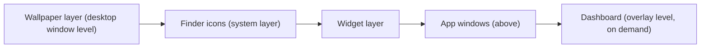

# Interaction model

The grammar of every input on the Desktop Frame surface: what hover, click, drag, resize, snap, selection, keyboard, and trackpad gestures do, how the surface coexists with Mission Control / Stage Manager / Spaces and multiple displays, and how focus, undo, and error recovery work. It is the canonical reference the component and widget docs defer to. The model is **direct-manipulation-first** ([ADR-0014](../Decisions/ADR-0014-direct-manipulation-widget-interaction-model.md)).

## Purpose and scope

In scope: the input grammar, desktop-environment coexistence, focus, undo/redo, and error recovery. Out of scope: widget-specific interactions in depth ([WidgetUX](WidgetUX.md)) and the engine that routes input ([DesktopEngine](../Architecture/DesktopEngine.md)).

## Design principles

- **Direct manipulation first.** Move by dragging, resize by an edge, see the result instantly; modes and dialogs are the exception ([ADR-0014](../Decisions/ADR-0014-direct-manipulation-widget-interaction-model.md)).
- **Calm at rest, capable on intent.** Affordances appear on hover/selection/edit-mode and vanish when done ([principle 2](../Design/DesignPhilosophy.md)).
- **Match macOS exactly.** Click, drag, right-click, gestures, and shortcuts behave as the user already expects; novelty is reserved for what has no convention.
- **Everything is reversible.** Manipulations are undoable; the model rarely needs a confirming dialog.

## The surface and its modes

The surface sits below app windows; widgets live above the wallpaper and below apps; the Dashboard floats above on demand ([WindowSystem](../Architecture/WindowSystem.md)). *(Diagram: the stacking order the interaction model operates within.)* The surface has two modes: **rest** (calm, click passes through to Finder/widgets) and **edit** (grid + handles, manipulation active). Mode change animates over `motion.default` ([MotionSystem](../Design/MotionSystem.md)).

## Input grammar

| Input | On a widget | On the canvas |
|---|---|---|
| Hover | Reveal handles/affordances (`motion.fast`) | — |
| Click | Select (in edit mode) / activate control | Deselect / pass through to Finder |
| Double-click | Open primary action / configure | — |
| Right-click | Context menu (configure, duplicate, layer, lock, remove) | Canvas menu (add widget, edit mode, settings) |
| Drag | Move (snaps to grid) | Rubber-band multi-select |
| Drag edge/corner | Resize (clamped, snaps) | — |
| Drop | Settle to grid with the spring | Place a new/duplicated widget |
| Trackpad gestures | Standard system gestures pass through; pinch is not hijacked | — |

Selection supports single, shift/⌘ multi-select, and rubber-band; the floating toolbar and inspector follow the selection ([Components/Navigation](../Components/Navigation.md)).

## Snapping

Widgets snap to the 8-pt grid on move and resize (`AppConstants.Widget.snapGrid`, [CGPoint/CGSize extensions](../../desktop-frame/Core/Extensions/CGPoint+Extensions.swift)); snapping settles with the standard spring. Snapping to other widgets' edges and to canvas guides is offered in edit mode. Sizes clamp to `minimumSize…maximumSize`. Snapping is what keeps a freely-arranged desktop tidy ([LayoutAndSpacing](../Design/LayoutAndSpacing.md)).

## Keyboard navigation

Every pointer action has a keyboard equivalent ([AccessibilityDesign](../Design/AccessibilityDesign.md)): Tab/arrow to select and move between widgets; arrows nudge a selected widget on the grid, modifier+arrows resize; Return/Space activates; Delete removes (undoable); Escape deselects/exits edit mode; ⌘, opens Settings; ⌘F searches. Focus is always visibly ringed. Standard macOS shortcuts are never overridden.

## Desktop-environment coexistence

- **Spaces.** The surface and widgets belong to a Space per the window collection behaviour; per-Space layouts are a design goal aligned with per-display layouts ([WindowSystem](../Architecture/WindowSystem.md), [ADR-0009](../Decisions/ADR-0009-per-display-independent-layouts.md)).
- **Mission Control.** Widgets behave predictably when Mission Control activates (they are part of the desktop, not floating clutter); the surface does not fight the system animation.
- **Stage Manager.** With Stage Manager on, the surface remains the backdrop; widgets do not interfere with staged windows. This coexistence is a known Sprint-1 risk area ([EngineeringReadinessAssessment](../Engineering/EngineeringReadinessAssessment.md)).
- **Multi-monitor.** Each display has its own layout; dragging a widget across displays reflows to the target's grid; hot-plug reconciles per [MultiMonitorArchitecture](../Architecture/MultiMonitorArchitecture.md).

## Focus management

One focus at a time, always visible. Transient surfaces (popover, sheet, dialog, Dashboard) move focus in and restore it on close ([Components/Overlays](../Components/Overlays.md)). The desktop surface participates in the responder chain so Full Keyboard Access reaches widgets ([AppKit bridge](../Design/EngineeringHandoff.md)).

## Undo / redo

Every manipulation — add, move, resize, configure, remove, group — is undoable via the standard ⌘Z / ⇧⌘Z, backed by a coalesced undo stack (a drag is one undo step, not many). This is what lets the design avoid confirming dialogs ([principle: reversible](../Design/DesignPhilosophy.md)). Destructive, non-undoable actions (uninstalling a plugin's data) are the rare exception that confirms.

## Error recovery

Interactions degrade gracefully: a failed configure keeps the prior state; a widget whose data source fails shows an error state with retry, not a crash ([Components/StatesAndFeedback](../Components/StatesAndFeedback.md)); a dropped/conflicting layout reconciles rather than losing widgets ([UserFlows](UserFlows.md) recovery).

## Accessibility

The whole grammar is keyboard- and VoiceOver-operable; affordances that appear on hover also appear on focus; nothing requires a gesture that has no keyboard equivalent ([AccessibilityDesign](../Design/AccessibilityDesign.md)).

## Performance

Drag/resize hold the display refresh rate; snapping is integer-grid arithmetic; hit-testing is bounded to the widget layer; gestures the system owns are passed through, not re-implemented ([PerformanceStandards](../Standards/PerformanceStandards.md), [RenderingEngine](../Architecture/RenderingEngine.md)).

## Trade-offs

- Direct manipulation everywhere costs more engineering (hit-testing, snapping, undo coalescing) than a forms-based editor; it is the core of the product feel and is worth it ([ADR-0014](../Decisions/ADR-0014-direct-manipulation-widget-interaction-model.md)).
- Passing system gestures through (not hijacking pinch/swipe) forgoes some custom gestures for native predictability.

## Future evolution

Per-Space layouts, alignment guides, and group manipulation extend the model; a command palette adds a keyboard-first path to every action ([UserFlows](UserFlows.md)). Scrubbable, gesture-driven transitions build on the existing spring.

## Open questions

- The exact Stage Manager coexistence behaviour, pending the Sprint-1 spike ([EngineeringReadinessAssessment](../Engineering/EngineeringReadinessAssessment.md)).
- Whether per-Space layouts ship in v1 or follow per-display layouts.

## References

1. [ADR-0014](../Decisions/ADR-0014-direct-manipulation-widget-interaction-model.md) · [DesktopEngine](../Architecture/DesktopEngine.md) · [WindowSystem](../Architecture/WindowSystem.md) · [MotionSystem](../Design/MotionSystem.md).
2. Apple, "HIG — Inputs / Pointing devices / Gestures." https://developer.apple.com/design/human-interface-guidelines/

## Completion checklist
- [x] Input grammar, snapping, and keyboard map specified.
- [x] Desktop-environment coexistence and focus/undo/recovery covered.
- [x] Surface-stacking diagram included.

## Review checklist
- [ ] Reconciled with DesktopEngine input routing and WindowSystem.
- [ ] Stage Manager / Mission Control behaviour verified by the spike.
- [ ] Meets DocumentationStandards.
