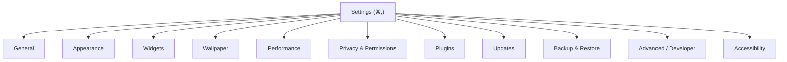

# Settings UX

The complete Settings experience: its structure, navigation, search, and every pane. Settings is where "default to less" is most tested — it must hold the product's full configurability without becoming a wall of switches ([principle 4](../Design/DesignPhilosophy.md)). The structure is recorded in [ADR-0015](../Decisions/ADR-0015-settings-information-architecture.md) and built from the [Settings/Preference-pane components](../Components/Navigation.md).

## Purpose and scope

In scope: Settings structure, navigation, search, and each pane's purpose and key controls. Out of scope: the broader product IA ([InformationArchitecture](InformationArchitecture.md)) and the control components ([Components/Controls](../Components/Controls.md)).

## Design principles

- **Standard macOS Settings pattern:** sidebar + detail, ⌘, to open, searchable — familiar, not invented ([Components/Navigation](../Components/Navigation.md)).
- **Progressive disclosure:** each pane shows the common controls; advanced lives behind a clearly-labelled disclosure ([InformationArchitecture](InformationArchitecture.md)).
- **Honest privacy controls:** anything touching data or the network is legible and off-by-default where consent is required ([SecurityStandards](../Standards/SecurityStandards.md)).

## Structure and navigation

A source-list sidebar of panes drives a detail view ([Components/Navigation](../Components/Navigation.md) Sidebar). *(Diagram: the top-level Settings map.)* Selection switches the detail with a quiet `motion.fast`; state is restored when Settings reopens.

## Search

A prominent search field filters across all panes and individual settings, returning a flat result list that deep-links to the exact control (highlighting it) ([Components/Controls](../Components/Controls.md) Search). Search is keyboard-first (⌘F) and shows a clear no-results state. It is the escape hatch that lets the panes stay calm — a buried advanced toggle is still findable.

## The panes

| Pane | Holds | Notes |
|---|---|---|
| **General** | Launch at login, menu-bar presence, default behaviours | `Storage.launchAtLoginKey` |
| **Appearance** | Theme/appearance mode, accent, density choices | → [ThemeArchitecture](../Design/ThemeArchitecture.md) |
| **Widgets** | Default widget behaviour, library, per-widget defaults | → [WidgetUX](WidgetUX.md) |
| **Wallpaper** | Per-display wallpaper, type, play-on-battery | → [WallpaperUX](WallpaperUX.md) |
| **Performance** | Frame/quality caps, animated-wallpaper limits, battery behaviour | → [PerformanceStandards](../Standards/PerformanceStandards.md); honest impact |
| **Privacy & Permissions** | Calendar/Reminders/Location/etc. grants, analytics consent | off-by-default consent ([SecurityStandards](../Standards/SecurityStandards.md)) |
| **Plugins** | Installed plugins, enable/configure/update/remove, permissions | → [Components/Marketplace](../Components/Marketplace.md) |
| **Updates** | App and plugin updates, channel, auto-update | → [ReleaseManagement](../Processes/ReleaseManagement.md) |
| **Backup & Restore** | Export/import layout & settings; restore a prior state | local; data stays on device without consent |
| **Accessibility** | App-level a11y options layered on the system settings | honours, never overrides, system settings |
| **Advanced / Developer** | Diagnostics, logging, plugin-dev tools | hidden until enabled; for power users/authors |

## Privacy and permissions UX

Permission requests are primed in-context (a primer explains *why* before the system prompt — [Components/StatesAndFeedback](../Components/StatesAndFeedback.md)); the Privacy pane is the single place to review and revoke. Analytics is opt-in with clear tiers; data stays on device without consent ([SecurityStandards](../Standards/SecurityStandards.md), [DesignPhilosophy](../Design/DesignPhilosophy.md)). The pane never dark-patterns toward granting.

## Backup and restore

Layout and settings export to a portable document and re-import on another machine or after a reset; restore is non-destructive (preview, then apply) and undoable where possible. This is the safety net behind every customisation ([WidgetUX](WidgetUX.md) persistence, [ADR-0008](../Decisions/ADR-0008-persistence-strategy.md)).

## Accessibility

The whole of Settings is keyboard-first and VoiceOver-coherent: the sidebar is a source list, panes have logical focus order, search is reachable by shortcut, every control is labelled ([AccessibilityDesign](../Design/AccessibilityDesign.md)). The Accessibility pane layers app options on top of (never overriding) the system settings.

## Performance

Settings is a standard, static form surface — no per-frame work; live previews (appearance, wallpaper) are debounced and reversible ([WallpaperUX](WallpaperUX.md)).

## Trade-offs

- The standard Settings pattern forgoes a novel configuration UX for familiarity and lower cognitive load.
- Progressive disclosure hides advanced controls a step deeper, trading discoverability for a calm default; search mitigates this.

## Future evolution

A command palette over settings and actions; profiles (named setting/layout bundles); per-Space settings. Plugin-contributed settings panes register through the SDK within this structure ([PluginSDK](../Architecture/PluginSDK.md)).

## Open questions

- Whether "Developer" is a separate pane or a mode that reveals advanced controls in each pane.
- Whether profiles belong in v1's Backup & Restore or a later release.

## References

1. [ADR-0015](../Decisions/ADR-0015-settings-information-architecture.md) · [InformationArchitecture](InformationArchitecture.md) · [SecurityStandards](../Standards/SecurityStandards.md) · [Components/Navigation](../Components/Navigation.md).
2. Apple, "HIG — Settings." https://developer.apple.com/design/human-interface-guidelines/settings

## Completion checklist
- [x] Structure, navigation, search, and every pane specified.
- [x] Privacy/permissions and backup/restore UX stated.
- [x] Settings-navigation diagram included.

## Review checklist
- [ ] Pane set reconciled with the feature matrix and SecurityStandards.
- [ ] Search deep-linking verified; keyboard-first confirmed.
- [ ] Meets DocumentationStandards.
