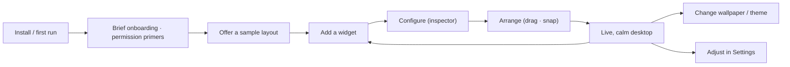

# User flows

The journeys that string the components and interactions into outcomes: first run, the core add-configure-arrange loop, recovery from failure, and the power-user paths. Flows are where the design is judged end-to-end — each must reach its outcome calmly, accessibly, and reversibly. They are grounded in the personas and jobs owned in Notion ([User Personas](https://app.notion.com/p/38bc634e2df681fc9e16ee4d5800bd82), [Jobs To Be Done](https://app.notion.com/p/38bc634e2df6813bb212cd692d2b4539)) and the [UX research](../Research/DesktopCustomizationUXResearch.md).

## Purpose and scope

In scope: the key user flows, journey maps, task analysis, onboarding strategy, recovery flows, and power-user workflows. Out of scope: the input grammar ([InteractionModel](InteractionModel.md)) and the IA map ([InformationArchitecture](InformationArchitecture.md)).

## Design principles

- **Value fast:** every flow reaches a useful outcome in the fewest steps; first run shows a configured desktop quickly ([principle 4](../Design/DesignPhilosophy.md)).
- **Reversible:** no flow has a point of no return short of an explicit, confirmed destructive action ([InteractionModel](InteractionModel.md)).
- **Considered failure:** every flow has its empty/error/recovery branch designed, not improvised ([Components/StatesAndFeedback](../Components/StatesAndFeedback.md)).

## The core journey

The loop the product lives in: add → configure → arrange → enjoy, returned to whenever the user wants more. *(Diagram: the core happy-path journey.)*

## Task analysis (the core tasks)

| Task | Steps (happy path) | Failure branch |
|---|---|---|
| Add a widget | Open library → pick → place (snaps) | Needs permission → primer → grant; or cancel |
| Configure a widget | Select → inspector → change (live preview) | Invalid value → inline error; revert |
| Arrange | Drag / resize (snap, undo) | — (always reversible) |
| Change wallpaper | Picker → preview live → apply / revert | Too costly → impact shown; fallback to static |
| Manage a plugin | Plugins pane → enable/configure/update/remove | Incompatible/quarantined → flagged + safe action |
| Recover a layout | Backup & Restore → preview → apply | Conflict → reconcile, never lose widgets |

Each task is keyboard- and VoiceOver-operable end to end ([AccessibilityDesign](../Design/AccessibilityDesign.md)).

## Onboarding strategy

Short, skippable, value-first ([Components/StatesAndFeedback](../Components/StatesAndFeedback.md)): a brief welcome, **in-context permission primers** (explain why before each system prompt, so grants are honest), and an **offer of a sample layout** so the user sees a configured desktop immediately rather than a blank one. Onboarding is re-openable from Help and never blocks the user from diving in. It leans on existing mental models so it can stay brief ([InformationArchitecture](InformationArchitecture.md)).

## Journey maps (by persona)

Mapped to the named personas (Notion): the **customiser** (deep arrangement, themes — needs power and reversibility), the **glanceable-info** user (a few system/calendar widgets — needs calm and reliability), the **minimalist** (one clock, a quiet wallpaper — needs defaults to be good), and the **accessibility-first** user "Sam" (full keyboard/VoiceOver throughout — the flows above are validated against this persona, not adapted afterward). Each journey hits the same loop but weights different steps; the design serves all without modes that fork the product.

## Recovery flows

- **Permission denied/revoked:** the widget shows a permission-needed empty state with a path to grant, never a broken widget ([Components/Widgets](../Components/Widgets.md)).
- **Data source fails:** error state with retry; last-known data with a timestamp where sensible ([Components/DataAndCharts](../Components/DataAndCharts.md)).
- **Display reconfiguration:** layouts reflow/reconcile; no widget is lost when a monitor unplugs ([MultiMonitorArchitecture](../Architecture/MultiMonitorArchitecture.md)).
- **Update / migration:** config migrates safely; a bad layout restores from backup ([ADR-0010](../Decisions/ADR-0010-widget-configuration-schema-versioning.md), [SettingsUX](SettingsUX.md)).
- **Misbehaving plugin:** isolated/quarantined, clearly flagged, with a safe disable/remove ([ADR-0007](../Decisions/ADR-0007-out-of-process-plugin-isolation.md)).

## Power-user workflows

Fast paths for frequent users: full keyboard control of the whole loop ([InteractionModel](InteractionModel.md)); multi-select and group arrange; backup/export to move a setup between machines; a future command palette and named profiles ([InformationArchitecture](InformationArchitecture.md)). Power features stay one disclosure deep so they never burden newcomers.

## Accessibility

Every flow is designed for keyboard and VoiceOver from the start and validated against the accessibility-first persona; no flow depends on a pointer-only gesture or on noticing a colour change ([AccessibilityDesign](../Design/AccessibilityDesign.md)).

## Performance

Flows avoid heavy work on the critical path: previews are downscaled, persistence is debounced, transient surfaces build on demand ([RenderingEngine](../Architecture/RenderingEngine.md)). First run reaches an interactive desktop quickly rather than precomputing everything.

## Trade-offs

- Offering a sample layout risks feeling prescriptive; mitigated by making it an easily-cleared starting point, not a lock-in.
- Designing every recovery branch is up-front effort; it is what makes the product feel reliable and is required by the quality bar.

## Future evolution

A command palette, named profiles, shareable/exportable layouts, and contextual just-in-time guidance replacing some onboarding. Marketplace-driven discovery flows as third-party content grows ([Components/Marketplace](../Components/Marketplace.md)).

## Open questions

- How much onboarding is front-loaded vs just-in-time ([Components/StatesAndFeedback](../Components/StatesAndFeedback.md) open question).
- Whether a sample layout is offered by default or only on request.

## References

1. [InteractionModel](InteractionModel.md) · [InformationArchitecture](InformationArchitecture.md) · [Research/DesktopCustomizationUXResearch](../Research/DesktopCustomizationUXResearch.md) · Notion [Personas](https://app.notion.com/p/38bc634e2df681fc9e16ee4d5800bd82)/[JTBD](https://app.notion.com/p/38bc634e2df6813bb212cd692d2b4539).
2. Apple, "HIG — Onboarding / Feedback." https://developer.apple.com/design/human-interface-guidelines/

## Completion checklist
- [x] Core journey, task analysis, and journey maps specified.
- [x] Onboarding, recovery, and power-user flows covered.
- [x] Core-journey diagram included.

## Review checklist
- [ ] Flows reconciled with personas/JTBD in Notion and the UX research.
- [ ] Every flow validated for keyboard/VoiceOver and recovery.
- [ ] Meets DocumentationStandards.
