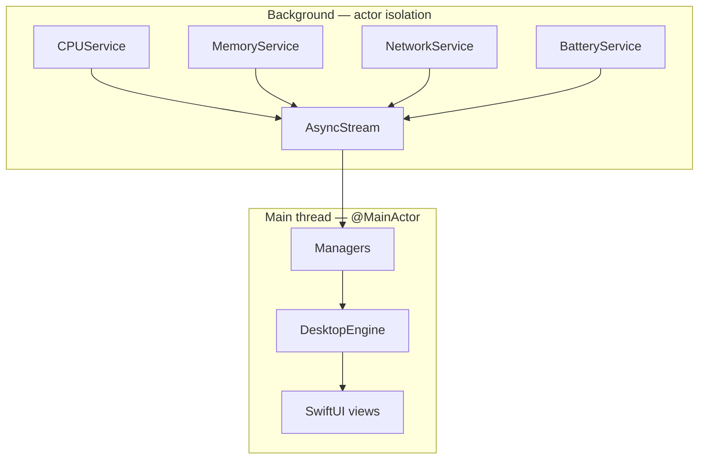

<!-- Logo placeholder — replace with Documentation/Design/assets/logo.png when available -->
<p align="center">
  <!--  -->
  <strong><sub>LOGO</sub></strong>
</p>

<h1 align="center">Desktop Frame</h1>

<p align="center">
  <em>The desktop layer macOS never shipped — live wallpaper, interactive widgets,<br/>and system information, built to Apple's quality bar.</em>
</p>

<p align="center">
  <a href="https://github.com/abarman152/desktop-frame/actions/workflows/ci.yml"></a>
  
  
  
  <a href="LICENSE"></a>
  
</p>

<p align="center">
  <a href="#overview">Overview</a> ·
  <a href="#features">Features</a> ·
  <a href="#architecture">Architecture</a> ·
  <a href="#development">Development</a> ·
  <a href="#documentation">Documentation</a> ·
  <a href="ROADMAP.md">Roadmap</a> ·
  <a href="#contributing">Contributing</a>
</p>

---

> **Project status — pre-release.** Desktop Frame is in active early development.
> The foundation (desktop window layer, core utilities, and the full engineering
> governance system) is in place; the user-facing capabilities below are the
> committed plan, sequenced in [ROADMAP.md](ROADMAP.md), not yet shipped. The
> first public build will be the **MVP**. What has actually landed is tracked in
> [CHANGELOG.md](CHANGELOG.md).

## Overview

The Mac desktop has barely changed in twenty years: a static wallpaper and a grid
of icons. The tools that try to fix this each solve one slice — Übersicht and
GeekTool give power users a scriptable desktop but demand code; Apple's widgets
are passive and vanish under windows; live-wallpaper apps look good but often
drain the battery. No single product makes the desktop **live, no-code, and
performant** at once.

**Desktop Frame is that product.** It turns the desktop from a static surface
into a configurable, intelligent workspace — live wallpaper, interactive widgets,
system monitoring, calendar and reminders, multi-monitor layouts, and themes —
delivered as a native macOS app that holds Apple's performance and privacy bar.

It is built in three stages, each a coherent product on its own:

1. **The surface** — a desktop people prefer to the default and keep running.
2. **The system** — how people run their desktop, day to day.
3. **The platform** — what others build on, through a plugin SDK and marketplace.

### Who it's for

Developers and power users who want their machine's health at a glance; traders
and creators who need live data across several displays; students who want a
calm, useful desktop without writing code; and designers who treat the desktop as
a canvas. One product reconciles them with quiet, beautiful defaults and opt-in
depth.

### Why it's different

- **Live and interactive**, where Apple's desktop widgets are passive.
- **No-code**, where Übersicht and GeekTool require HTML/CSS/JS or shell.
- **Performant by gate**, not by accident — hardware-decoded wallpaper and a
  measured energy budget, so it never becomes the app that kills your battery.
- **Unified** — wallpaper, widgets, layout, and theming in one coherent surface
  instead of a stack of mismatched utilities.
- **Private by default** — all user data stays on device; no telemetry without
  consent. Transparent ownership and honest pricing are a stated posture.

## Features

Capabilities are grouped by the stage that delivers them (see [ROADMAP.md](ROADMAP.md)).
Items marked _planned_ are designed and specified but not yet shipped.

| Capability | What it does | Stage |
|---|---|---|
| **Desktop Canvas** | A transparent, non-activating layer below the icons, on every display | MVP |
| **Widgets** | Live, interactive, native widgets you place with no code | MVP |
| **System Monitoring** | Glanceable CPU, memory, battery, and network | MVP |
| **Wallpaper Engine** | Static and hardware-decoded live wallpaper, per display | MVP → v0.5 |
| **Multi-Monitor** | First-class per-display canvas, widgets, and layout, hot-plug safe | MVP |
| **Settings** | No-code configuration with quiet defaults and opt-in depth | MVP |
| **Calendar & Reminders** | Always-visible schedule and tasks via EventKit | v0.2 |
| **Layout Manager** | Visual arrange, snap, align, and group, free of Apple's grid | v0.5 |
| **Themes** | Tokenized, wallpaper-aware theming across widgets | v0.5 |
| **Plugin SDK** | A documented, sandboxed API for third-party widgets | v1.0 |
| **Marketplace** | Discover, install, and share widgets and themes | v1.0 |
| **AI Features** | On-device, opt-in intelligent widgets (Foundation Models) | v1.0 |
| **Accessibility** | A release gate: VoiceOver, full keyboard, Reduce Motion/Transparency | every release |
| **Performance** | Idle CPU < 0.5%/core, < 80 MB resident, render < 8 ms @ 120 Hz | every release |
| **Privacy** | On-device data, no telemetry without consent | every release |

## Screenshots

_Coming soon._ Placeholders below will be replaced as the surface comes together.

| | |
|---|---|
| **Desktop** — the surface with live wallpaper and widgets | _screenshot pending_ |
| **Settings** — no-code configuration | _screenshot pending_ |
| **Widgets** — the system and data widget set | _screenshot pending_ |
| **Wallpaper** — hardware-decoded live wallpaper | _screenshot pending_ |
| **Multi-Monitor** — coherent behavior across displays | _screenshot pending_ |

## Architecture

Desktop Frame is a layered, protocol-driven app. Every layer has one
responsibility and depends on abstractions, not concrete types. The desktop-layer
window is an `NSWindow` subclass (for window-level control AppKit alone provides),
with content rendered by SwiftUI through `NSHostingView`.

```
┌─────────────────────────────────────────────────────────┐
│                        App Layer                         │
│      DesktopFrameApp  ·  AppDelegate  ·  Settings        │
├─────────────────────────────────────────────────────────┤
│                      Feature Layer                       │
│   Desktop  ·  Widgets  ·  Wallpaper  ·  Calendar  …      │
├─────────────────────────────────────────────────────────┤
│                       Core Layer                         │
│   Engines  ·  Managers  ·  Services  ·  Window System    │
├─────────────────────────────────────────────────────────┤
│                    Foundation Layer                      │
│         Models  ·  Utilities  ·  Extensions              │
└─────────────────────────────────────────────────────────┘
```

Concurrency follows Swift 6 strict-concurrency rules: system-data **services are
`actor` types** that poll off the main thread; **managers are `@MainActor`** and
drive the UI. Data flows upward, never sideways.



The full design, key decisions, and module ownership are in
[Documentation/Architecture.md](Documentation/Architecture.md). Architectural
changes are recorded as ADRs in [Documentation/Decisions/](Documentation/Decisions/README.md).

## Repository structure

```
desktop-frame/
├── desktop-frame/            App source — App, Core (Engine/Managers/Services/
│                             Window/Utilities/Extensions), Features, Models
├── desktop-frame.xcodeproj/  Xcode project
├── Tests/                    Test targets
├── Scripts/                  Build and tooling scripts
├── Documentation/            Version-controlled docs (the knowledge base)
│   ├── Architecture.md       System design
│   ├── Standards/            Enforceable rules (Swift, naming, security, perf, a11y)
│   ├── Processes/            How we work (git, releases, quality gates, versioning)
│   ├── Decisions/            Architecture Decision Records (one immutable file each)
│   ├── Templates/            Canonical templates every new doc copies from
│   └── README.md             Documentation hub and governance hierarchy
├── .agents/                  AI agent role definitions + the nine-phase workflow
├── .github/                  Community & template files (Contributing, Security, …)
├── .templates/               Non-document code scaffolding
├── .docs/                    Documentation tooling config
├── CLAUDE.md                 The operating constitution for humans and AI agents
├── ROADMAP.md · CHANGELOG.md · LICENSE
```

The placement rule for any new file is defined in
[Documentation/Standards/FolderStructure.md](Documentation/Standards/FolderStructure.md):
source under `desktop-frame/`, docs under `Documentation/`, community files under
`.github/` — one home per file, cross-referenced by link, never copied.

## Technology stack

| Area | Technology |
|---|---|
| Language | **Swift 6** (strict concurrency complete) |
| UI | **SwiftUI** for content, **AppKit** for the window system |
| Concurrency | **Swift Concurrency** — `actor`, `@MainActor`, `Sendable`, `async/await` |
| Rendering | **Core Animation**, **Metal**, hardware video decode (**AVFoundation / VideoToolbox**) |
| Reactivity | The `@Observable` macro (not `ObservableObject`) |
| System data | **IOKit**, **Network.framework**, Darwin host statistics |
| Calendar / Reminders | **EventKit** |
| Logging | **OSLog** (subsystem `com.desktopframe.app`) |
| Sync (v1.0) | **CloudKit / iCloud** |
| On-device AI (v1.0) | **Foundation Models** |

No Electron, no Catalyst-as-a-shortcut, no cross-platform UI toolkits, and no
private Apple APIs — by policy. See [CLAUDE.md](CLAUDE.md).

## Development

### Prerequisites

| Tool | Minimum | Notes |
|---|---|---|
| macOS | 15.0 Sequoia | `@Observable`, Swift 6 runtime |
| Xcode | 16.0 | Swift 6 toolchain |
| Swift | 6.0 | Strict concurrency complete |

Apple Silicon first. No `pod install` or package resolution is required today;
Swift Package Manager dependencies resolve automatically on first build.

### Clone, build, run

```bash
# 1. Clone
git clone https://github.com/abarman152/desktop-frame.git
cd desktop-frame

# 2. Open in Xcode
open desktop-frame.xcodeproj

# 3. Select the `desktop-frame` scheme and a macOS destination, then ⌘R
```

The app runs as a menu-bar accessory (no Dock icon); open it from the status bar
or press **⌘,** for Settings. View structured logs in **Console.app**, filtered
by subsystem `com.desktopframe.app`.

### Testing & formatting

```bash
# Run tests
xcodebuild test -scheme desktop-frame -destination 'platform=macOS'

# Format before committing (config: .swift-format at repo root)
swift-format format --in-place --recursive desktop-frame/
```

All concurrency warnings are treated as errors; the build must stay green. Full
guidance is in [Documentation/DevelopmentSetup.md](Documentation/DevelopmentSetup.md).

## Documentation

The knowledge base lives in [`Documentation/`](Documentation/README.md), which is
the navigation hub and governance hierarchy. Start there, then go deep:

- **Architecture** — [Architecture.md](Documentation/Architecture.md) · [Decisions (ADRs)](Documentation/Decisions/README.md)
- **Standards** — [Swift style](Documentation/Standards/SwiftStyleGuide.md) · [naming](Documentation/Standards/NamingConventions.md) · [performance](Documentation/Standards/PerformanceStandards.md) · [security](Documentation/Standards/SecurityStandards.md) · [accessibility](Documentation/Standards/AccessibilityStandards.md)
- **Processes** — [git workflow](Documentation/Processes/GitWorkflow.md) · [quality gates](Documentation/Processes/QualityGates.md) · [releases](Documentation/Processes/ReleaseManagement.md) · [versioning](Documentation/Processes/VersioningStrategy.md)
- **Templates** — [Documentation/Templates/](Documentation/Templates/) (every new doc copies from here)
- **Governance** — [the documentation hub](Documentation/README.md) and the [governance audit](Documentation/Engineering/GovernanceAuditReport.md)
- **Constitution** — [CLAUDE.md](CLAUDE.md), the operating rules for every contributor, human or AI

## Roadmap

Desktop Frame ships to a quality bar, not a calendar. The committed sequence —
**MVP → v0.2 → v0.5 → v1.0 → Post-1.0** — moves from the surface to the system to
the platform. The current focus is the **MVP surface**. Full detail, with exit
criteria per milestone, is in [ROADMAP.md](ROADMAP.md).

## Contributing

Contributions are welcome. The short version:

1. Find or open an issue describing the work.
2. Branch from `main` per the [branching strategy](Documentation/Standards/BranchingStrategy.md)
   (`feature/…`, `fix/…`, `docs/…`, `refactor/…`).
3. If the change touches architecture, write an ADR first.
4. Implement in small steps that keep the build green; follow the
   [Swift style guide](Documentation/Standards/SwiftStyleGuide.md).
5. Add tests — a bug fix adds a test that fails without the fix.
6. Update any documentation the change affects, in the same pull request.
7. Open a PR using the template and run the [review checklist](Documentation/Standards/ReviewChecklist.md).

Commits follow [Conventional Commits](Documentation/Standards/CommitConvention.md).
Read [.github/CONTRIBUTING.md](.github/CONTRIBUTING.md) and the
[nine-phase workflow](.agents/AGENTS.md) before your first change. Participation is
governed by the [Code of Conduct](.github/CODE_OF_CONDUCT.md).

## Community

- **Discussions** — questions, ideas, and show-and-tell: [GitHub Discussions](https://github.com/abarman152/desktop-frame/discussions)
- **Issues** — [report a bug](https://github.com/abarman152/desktop-frame/issues/new?template=bug_report.md) · [request a feature](https://github.com/abarman152/desktop-frame/issues/new?template=feature_request.md)
- **Support** — see [.github/SUPPORT.md](.github/SUPPORT.md)
- **Security** — report vulnerabilities privately per the [security policy](.github/SECURITY.md); never in a public issue.

## License

Released under the [MIT License](LICENSE). © 2026 Abir Barman and Desktop Frame contributors.

## Acknowledgements

Desktop Frame stands on the shoulders of the macOS customization community —
Übersicht, GeekTool, and the tools that proved people want a living desktop — and
on the craft standard set by apps like iStat Menus, Backdrop, Rectangle, and
Raycast. It is built with Apple's frameworks and informed by the
[Human Interface Guidelines](https://developer.apple.com/design/human-interface-guidelines/).

## Future vision

The long arc is a platform: once the surface earns daily use, a sandboxed plugin
SDK and a marketplace let anyone build and share widgets and themes — the
defensible endgame that Rainmeter's skins and Raycast's extensions prove on other
surfaces, brought natively to the Mac desktop. Desktop Frame aims to become the
operating layer for the macOS desktop: the thing you install first on a new Mac,
and the standard others build on.
